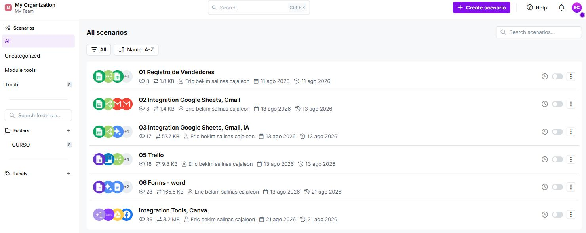
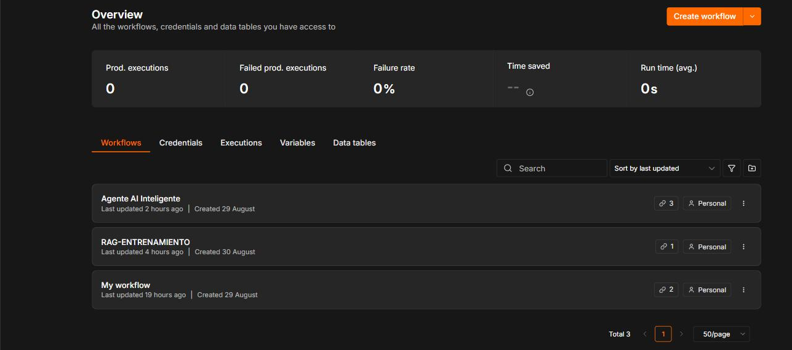
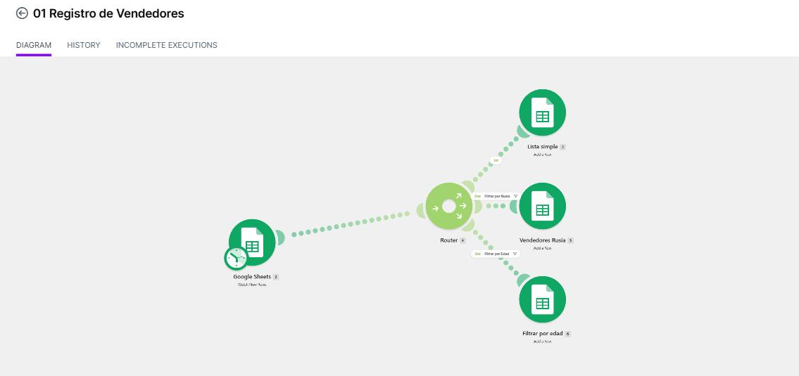
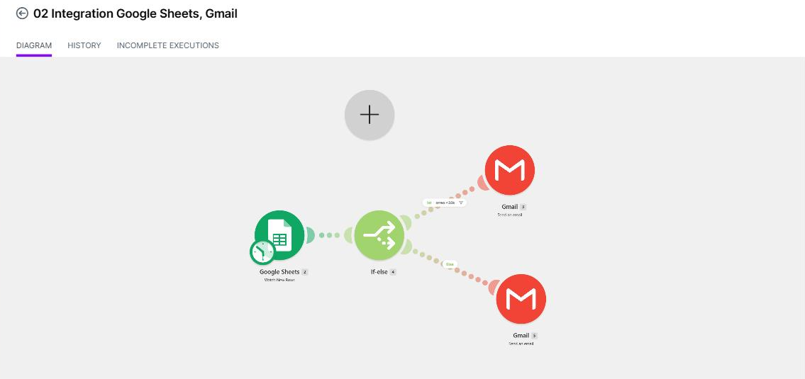
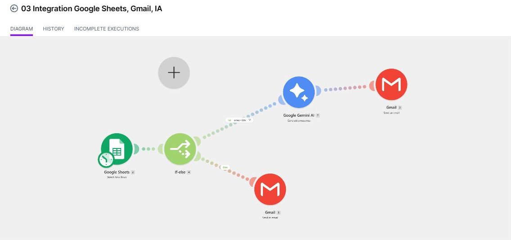
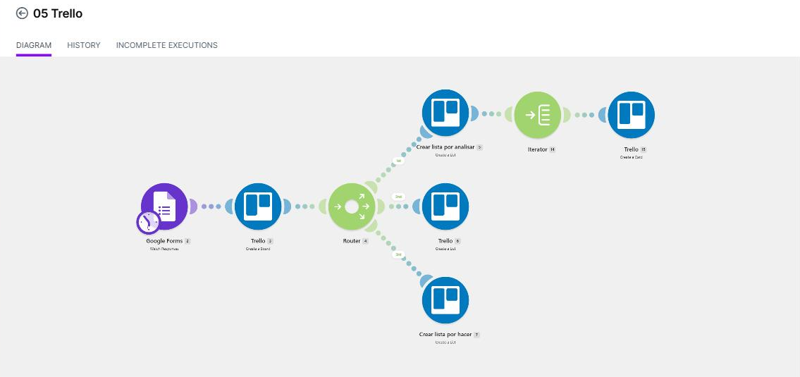
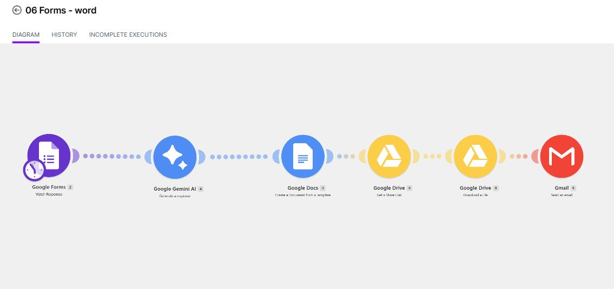
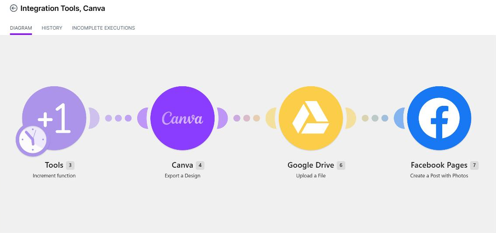
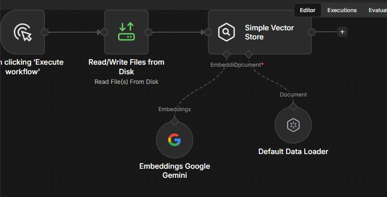
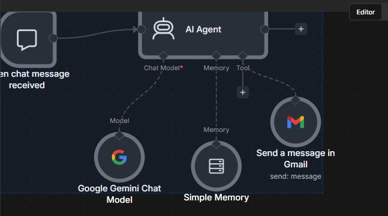

# 🤖 Automatizaciones e IA Aplicada
### **Eric Salinas Cajaleón** | Ingeniería Industrial y de Sistemas — **Universidad de Piura (UDEP)**
`n8n` · `Make` · `Google Gemini` · `RAG` · `Vector Stores` · `Google Workspace API` · `Telegram Bot API`

> **Nueve flujos** construidos y ejecutados de punta a punta en dos cursos del
> **CTIC – UNI (Programa de Innovación Tecnológica, PIT)**:
> **PIT629 · Aplicaciones de Inteligencia Artificial** y
> **PIT634 · Automatización de Negocios con Gemini** — ambos completados al 100 %.
>
> Cada flujo está documentado por **el problema que resuelve, la decisión de diseño
> detrás y la evidencia de que corrió** (operaciones, tiempo y fecha de ejecución real).

[⬅️ Volver al portafolio principal](../README.md)

---

## Índice

| # | Flujo | Plataforma | Qué demuestra |
|---|---|---|---|
| 1 | [Registro y segmentación de vendedores](#1-registro-y-segmentación-automática-de-vendedores) | Make | Enrutamiento condicional, filtros, escritura multi-destino |
| 2 | [Alertas de KPI por umbral](#2-alertas-de-kpi-por-umbral) | Make | Lógica if/else sobre datos de negocio |
| 3 | [Alertas de KPI con mensaje generado por IA](#3-alertas-de-kpi-con-mensaje-generado-por-ia) | Make + Gemini | LLM dentro de un proceso, con línea base para comparar |
| 4 | [De formulario a tablero de proyecto](#4-de-formulario-a-tablero-de-proyecto) | Make + Trello | Router + iterator, generación de N registros hijos |
| 5 | [Generación documental de extremo a extremo](#5-generación-documental-de-extremo-a-extremo) | Make + Gemini + Google Workspace | Cadena de 6 operaciones, plantillas, entrega |
| 6 | [Publicación automatizada de contenido](#6-publicación-automatizada-de-contenido) | Make + Canva | Integración con API de terceros, control de secuencia |
| 7 | [Pipeline de ingesta documental para RAG](#7-pipeline-de-ingesta-documental-para-rag) | n8n + Gemini Embeddings | Chunking, embeddings, base vectorial |
| 8 | [Agente conversacional RAG](#8-agente-conversacional-rag-sobre-documentos-académicos) | n8n + Gemini + Telegram | Agente con herramientas, memoria, modelo de respaldo |
| 9 | [Agente de correo por lenguaje natural](#9-agente-de-correo-por-lenguaje-natural) | n8n + Gemini + Gmail | Extracción de parámetros desde lenguaje natural |

---

## Panorama

**Make — 6 escenarios**



**n8n — 3 workflows**



---

# Parte I · Make — Automatización de procesos de negocio

## 1. Registro y segmentación automática de vendedores



**El problema.** Una base de vendedores en Google Sheets donde cada registro nuevo
tiene que terminar en la hoja que le corresponde según su perfil. Hecho a mano es
copiar y pegar, y el criterio de clasificación vive en la cabeza de quien lo hace.

**Cómo está construido.**

```
Google Sheets (Watch New Rows)
        │
     Router
        ├── [sin filtro] ─────────────→ Google Sheets · "Lista simple"
        ├── [Filtrar por Rusia] ──────→ Google Sheets · "Vendedores Rusia"
        └── [Filtrar por edad] ───────→ Google Sheets · "Filtrar por edad"
```

**Decisiones de diseño**

- El **router** con filtros nombrados deja el criterio de segmentación *escrito y auditable*,
  en vez de implícito. Cualquiera puede abrir el escenario y ver por qué un registro
  fue a una hoja y no a otra.
- Los filtros son **excluyentes por rama pero no mutuamente exclusivos**: un registro puede
  caer en más de un destino, que es el comportamiento correcto para clasificaciones
  que se solapan (nacionalidad y rango de edad son dimensiones distintas).

**Evidencia.** 3 operaciones por ejecución, ~1 s, corridas exitosas registradas el 11 ago 2026.

**Qué transfiere a un rol de datos.** Es una regla de negocio convertida en pipeline:
exactamente lo que se hace con `CASE WHEN` en SQL o `np.select` en pandas, pero con
el flujo de datos visible.

---

## 2. Alertas de KPI por umbral



**El problema.** Detectar registros de venta por debajo de un umbral y avisar,
sin que nadie tenga que revisar la hoja.

**Cómo está construido.**

```
Google Sheets (Watch New Rows)
        │
    If-else  ──[ ventas < 30K ]──→ Gmail · correo de seguimiento
             └─[ Else ]──────────→ Gmail · notificación estándar
```

**Decisiones de diseño**

- El umbral (30 K) es un **parámetro del flujo**, no una condición enterrada en el texto
  del correo: cambiarlo no obliga a rehacer la lógica.
- Las dos ramas terminan en la misma acción (correo) pero con contenido distinto — la
  bifurcación existe para el *mensaje*, no para el *canal*.

**Evidencia.** 2 operaciones, ~1 s por ejecución, corridas exitosas el 13 ago 2026.

---

## 3. Alertas de KPI con mensaje generado por IA



**El problema.** El correo de la versión anterior es una plantilla fija. ¿Aporta algo
que un modelo redacte el mensaje con el contexto del registro?

**Cómo está construido.**

```
Google Sheets (Watch New Rows)
        │
    If-else  ──[ ventas < 30K ]──→ Google Gemini AI (Generate a response) ──→ Gmail
             └─[ Else ]───────────────────────────────────────────────────→ Gmail
```

**La decisión que más me interesa de este repo.** Este escenario **no reemplazó** al
anterior: los dos existen. El #2 es la línea base sin IA y el #3 es la variante con IA,
sobre el mismo disparador y el mismo umbral. Eso permite comparar el aporte real del
modelo en lugar de asumirlo. Es la misma lógica de un *A/B* o de un modelo contra un
*baseline* trivial: si la versión sofisticada no le gana a la simple, la simple gana.

- El LLM se invoca **solo en la rama que lo necesita** (bajo desempeño). La rama normal
  no gasta tokens ni introduce variabilidad donde una plantilla basta.

**Evidencia.** 3 operaciones, 10–18 s por ejecución (el modelo es el paso lento),
17.5 KB de datos, corridas exitosas el 13 ago 2026.

---

## 4. De formulario a tablero de proyecto



**El problema.** Una solicitud enviada por formulario debería llegar ya convertida en
un plan de trabajo, no en una fila más que alguien tiene que transcribir.

**Cómo está construido.**

```
Google Forms (Watch Responses)
        │
Trello · Create a Board
        │
     Router
        ├── Crear lista "Por analizar" ──→ Iterator ──→ Trello · Create a Card (×N)
        ├── Crear lista (estado 2)
        └── Crear lista "Por hacer"
```

**Decisiones de diseño**

- El **iterator** es la pieza clave: convierte un campo con varios ítems en *N* tarjetas
  independientes. Sin él, todo el contenido cabría en una sola tarjeta y el tablero no
  serviría para trabajar.
- Las listas se crean en el mismo flujo que el tablero: el resultado es un tablero
  **usable desde el primer segundo**, no un tablero vacío que hay que configurar.

**Evidencia.** 8 operaciones, ~2 s, corridas exitosas el 13 ago 2026.

---

## 5. Generación documental de extremo a extremo



**El problema.** Producir un documento personalizado a partir de una solicitud y
hacerlo llegar a su destinatario, sin pasos manuales en el medio.

**Cómo está construido.**

```
Google Forms (Watch Responses)
   → Google Gemini AI (Generate a response)          ← genera el contenido
   → Google Docs (Create a Document from a Template) ← lo vacía en la plantilla
   → Google Drive (Get a Share Link)                 ← lo publica
   → Google Drive (Download a File)                  ← lo obtiene como archivo
   → Gmail (Send an Email)                           ← lo entrega
```

**Decisiones de diseño**

- **Plantilla + contenido separados.** El modelo produce el texto; el formato lo pone
  la plantilla de Docs. Así el resultado es consistente aunque el modelo varíe.
- Se genera **enlace y archivo adjunto**: el enlace sirve para colaborar, el archivo
  para quien solo quiere el documento. Dos operaciones distintas de Drive, a propósito.

**Evidencia.** 6 operaciones encadenadas, **~36 s de punta a punta**, 67.8 KB,
corrida exitosa el 21 ago 2026. Es el flujo más largo del repositorio y el que mejor
muestra encadenamiento de servicios.

---

## 6. Publicación automatizada de contenido



**Cómo está construido.**

```
Tools (Increment function) → Canva (Export a Design) → Google Drive (Upload a File)
                                                     → Facebook Pages (Create a Post with Photos)
```

**Decisiones de diseño**

- La **función de incremento** lleva el contador de la secuencia: es lo que evita
  republicar la misma pieza y da trazabilidad de qué diseño salió en qué orden.
- Drive actúa como **almacenamiento intermedio** entre el exportador y la red: si la
  publicación falla, el archivo ya está guardado y no hay que re-exportar.

**Evidencia.** 4 operaciones, ~11 s, 3.3 MB de transferencia (el flujo con más peso de
datos, por las imágenes), corridas del 21 ago 2026 — con **una ejecución en error registrada**,
que dejo visible a propósito: los flujos con dependencias externas fallan, y el registro
de fallos es parte del trabajo.

---

# Parte II · n8n — Agentes de IA y RAG

Los tres workflows funcionan como un sistema: uno **construye** la base de conocimiento,
otro la **consulta** a través de un agente, y el tercero explora el patrón de agente con
herramientas en un caso más simple.

## 7. Pipeline de ingesta documental para RAG



**El problema.** Un modelo de lenguaje no conoce mis sílabos ni mis documentos.
Para que responda sobre ellos hay que indexarlos primero.

**Cómo está construido.**

```
Manual Trigger
   → Read/Write Files from Disk   (lee todos los PDFs de una carpeta)
        └── Default Data Loader   (modo binario: segmenta el documento en chunks)
        └── Embeddings Google Gemini (vectoriza cada chunk)
   → Simple Vector Store (modo insert)
```

**Decisiones de diseño**

- **La ingesta está separada del agente**, en un workflow propio. Eso permite reindexar
  el corpus —añadir un sílabo, corregir uno— sin tocar la lógica del agente ni
  arriesgarse a romperla.
- Trigger **manual** y no programado: la reindexación es una operación deliberada,
  no algo que deba pasar solo mientras nadie mira.
- Lectura **por carpeta con comodín** (`*.pdf`), no archivo por archivo: el corpus crece
  sin editar el flujo.

**Qué transfiere a un rol de datos.** Esto es un ETL: extraer (leer PDFs),
transformar (segmentar y vectorizar), cargar (insertar en el store). El vocabulario
cambia, la estructura no.

---

## 8. Agente conversacional RAG sobre documentos académicos


**El problema.** Responder preguntas sobre sílabos universitarios —contenidos,
unidades, evaluaciones, bibliografía— en lenguaje natural y desde el celular.

**Cómo está construido.**

```
Telegram Trigger  ─┐
Chat Trigger      ─┴→ AI Agent ──→ Telegram · Send a text message (parse_mode: HTML)
                        │
                        ├── Chat Model:     Google Gemini
                        ├── Fallback Model: Google Gemini (segundo modelo)
                        ├── Memory:         Simple Memory (ventana de 7 turnos,
                        │                   sesión por ID de chat)
                        └── Tools:
                              ├── Answer questions with a vector store
                              │      ├── Simple Vector Store
                              │      ├── Embeddings Google Gemini
                              │      └── Modelo dedicado para la síntesis
                              └── Send an Email
```

**Decisiones de diseño**

- **Modelo de respaldo activado** (`needsFallback`). Si el modelo principal falla o
  está saturado, el agente responde igual. Es tolerancia a fallos, no un lujo.
- **Sesión aislada por chat** (`{{ $json.message.chat.id }}_v2`): dos personas hablando
  con el mismo agente no se contaminan la conversación. El sufijo `_v2` permite invalidar
  el historial cuando cambia el prompt del sistema, sin borrar nada.
- **Ventana de 7 turnos**, no ilimitada: contexto suficiente para una consulta encadenada
  sin inflar el costo ni arrastrar ruido.
- **El prompt del sistema le exige declarar cuándo no sabe**: *"Si no encuentras la
  información, dilo claramente."* Es la única defensa barata contra la alucinación en
  un sistema RAG, y está escrita explícitamente.
- **La herramienta del vector store lleva su propia descripción detallada** —qué contienen
  los documentos y cuándo usarlos—. En un agente con varias herramientas, esa descripción
  es lo que decide si el modelo elige bien.
- **Formato de salida restringido a las etiquetas HTML que Telegram admite**, porque el
  canal de entrega impone sus reglas y un modelo sin restricción devuelve Markdown que
  se rompe.

---

## 9. Agente de correo por lenguaje natural



**Cómo está construido.**

```
Chat Trigger → AI Agent ──┬── Chat Model: Google Gemini
                          ├── Memory: Simple Memory (7 turnos)
                          └── Tool: Gmail · Send a message
```

**Decisiones de diseño**

- La herramienta de Gmail recibe **destinatario, asunto y cuerpo como parámetros extraídos
  por el modelo** (`$fromAI`) desde la instrucción en lenguaje natural, con una descripción
  explícita de qué debe ir en cada campo. El modelo no "escribe un correo": **rellena un
  contrato de parámetros**, que es lo que hace el resultado predecible.

---

## Stack

| Categoría | Herramientas |
|---|---|
| Automatización | n8n (self-hosted), Make |
| Modelos | Google Gemini (chat, embeddings) |
| RAG | Vector store en memoria, data loader con chunking, embeddings |
| Datos y ofimática | Google Sheets, Google Docs, Google Forms, Google Drive |
| Mensajería | Telegram Bot API, Gmail, SMTP |
| Gestión | Trello |
| Contenido | Canva, Facebook Pages |

---

## Formación de la que salen estos flujos

**CTIC – UNI · Programa de Innovación Tecnológica (PIT)**

- ✅ **PIT629 — Aplicaciones de Inteligencia Artificial** *(100 % completado)* → Parte II
- ✅ **PIT634 — Automatización de Negocios con Gemini** *(100 % completado)* → Parte I
- ✅ PIT695 — Machine Learning con Python
- ✅ PIT658 — Finanzas: Principios y Tendencias para la Toma de Decisiones Tecnológicas

En programa: Inferencia Estadística con Python · Series de Tiempo con Python ·
Machine Learning con Python + IA · Ciencia de Datos 2: Big Data ·
Cloud Computing (AWS – Azure – Google Cloud).

---

## Lo que falta y lo sé

Escribo esto porque un portafolio honesto vale más que uno perfecto:

- **El vector store es en memoria.** Sirve para el caso de estudio; para producción
  habría que llevarlo a una base persistente (pgvector, Qdrant) para no reindexar
  en cada arranque.
- **No hay evaluación del RAG.** No mido si la respuesta es correcta ni si la
  recuperación trajo el chunk adecuado. Es el siguiente paso: un set de preguntas
  con respuesta conocida y una métrica de aciertos.
- **Los escenarios de Make están inactivos**, ejecutados en modo manual. Corrieron,
  están registrados, pero no hay carga sostenida detrás.
- **Sin manejo explícito de errores** en la mayoría de flujos: el escenario de Canva
  tiene un fallo registrado y no hay rama de reintento.

---

*Documentado a partir de la inspección directa de los escenarios y workflows —
estructura de nodos, filtros, prompts de sistema e historial de ejecuciones —
el 30 de agosto de 2026.*
