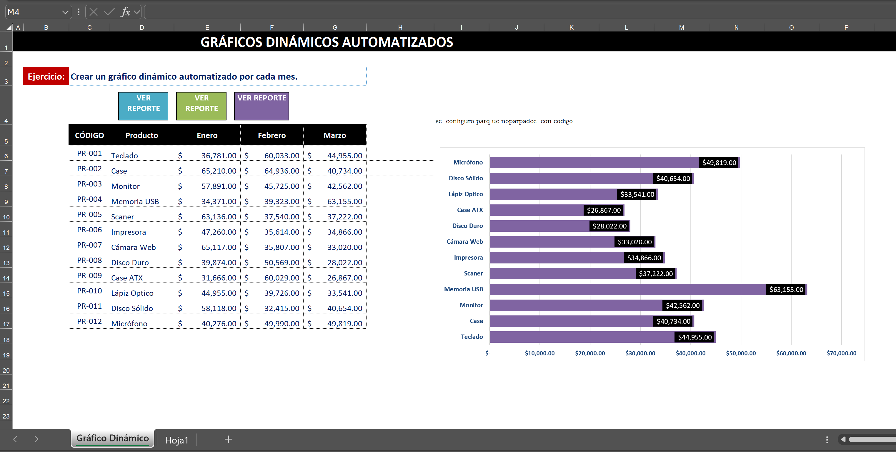

# 📂 Excel for Engineering & Advanced Automation

Este repositorio compila soluciones avanzadas desarrolladas en Microsoft Excel, enfocadas en la optimización de procesos, automatización de tareas mediante VBA y análisis estadístico para la toma de decisiones en ingeniería.

## 🛠️ Inventario Técnico de Soluciones Avanzadas (Excel & VBA)

---

| Proyecto / Archivo | Valor Estratégico (Por qué es Pro) | Operación Interna (¿Qué hace adentro?) |
| :--- | :--- | :--- |
| **1. FUNCION SOLVER EXEL** | **Investigación de Operaciones.** Muestra dominio de Programación Lineal y optimización de costos. | Configuración del motor **Simplex LP** para hallar la mezcla óptima de insumos (Nitrógeno, Potasio, Fosfato) minimizando el costo total bajo restricciones de masa y nutrientes. |
| **2. PREDICIONES Y PREVISIONES** | **Analítica Predictiva.** Fundamental para Planeamiento de la Producción (PCP) y Finanzas.   | Aplicación de **Suavizamiento Exponencial (ETS)** y Regresión Lineal sobre series de tiempo para proyectar demanda futura con intervalos de confianza. |
| **3. Calificación de Proveedores** | **Gestión de SCM (Supply Chain).** Toma de decisiones basada en KPIs ponderados.   | Desarrollo de una **Matriz de Decisión Multicriterio** con Dashboards interactivos que evalúan Precio, Calidad y Plazos mediante filtros dinámicos. |
| **4. Filtros Avanzados Interactivos** | **Automatización UX/UI.** Mejora radicalmente la velocidad de búsqueda en bases de datos. | Programación en **VBA** del objeto `AdvancedFilter` conectado a celdas de criterios, permitiendo extraer reportes específicos con un solo clic. |
| **5. Enviar correos con VB** | **Automatización de Procesos (RPA).** Integración de sistemas de oficina. | Script en VBA que interactúa con la **Librería de Outlook** para generar y enviar notificaciones personalizadas basadas en condiciones lógicas de la hoja. |
| **6. Formulario con Imágenes** | **Desarrollo de Software.** Manejo avanzado de objetos y bases de datos gráficas. | Creación de un **UserForm (Formulario de Usuario)** que carga dinámicamente imágenes desde una ruta local según el ID del registro seleccionado. |
| **7. Creación Dash MACROS** | **Business Intelligence Dinámico.** Reporting autogestionable.   | Automatización mediante macros para la limpieza de datos (`ETL`) y construcción instantánea de tablas y gráficos dinámicos para KPIs. |
| **8. Gráficos Dinámicos Auto23** | **Reporting de Alto Impacto.** Evita el mantenimiento manual de reportes.   | Uso de **Rangos Dinámicos** (Función `DESREF` o `TABLA`) y macros de actualización para que los gráficos crezcan automáticamente al ingresar nuevos datos. |
| **9. Variables y Constantes** | **Arquitectura de Software.** Demuestra estándares de programación robustos. | Implementación de **Declaración Explícita de Variables** (`Dim`, `Integer`, `String`) y Constantes Globales para optimizar el uso de memoria y evitar errores de lógica. |
| **10. Funciones Estadísticas** | **Análisis de Datos Puro.** Dominio total de la lógica de fórmulas. | Aplicación de fórmulas anidadas complejas (`CONTAR.SI.CONJUNTO`, `K.ESIMO.MAYOR`, `INDICE+COINCIDIR`) para auditoría de bases de datos masivas. |
| **11. Examen Cámara Comercio** | **Certificación de Campo.** Validación de habilidades bajo presión. | Resolución de desafíos de lógica, búsqueda y ordenamiento en formato **Binario (.xlsb)** para maximizar la velocidad de procesamiento de datos. |
| **12. Función MsgBox** | **Control de Errores y Flujo.** Interacción segura con el usuario final. | Desarrollo de cuadros de diálogo interactivos que condicionan la ejecución de macros según la respuesta del usuario (`Sí/No/Cancelar`). |
| **13. macros2** | **Eficiencia Operativa.** Estandarización de tareas repetitivas. | Secuenciación de comandos VBA para el formateo, consolidación y exportación de archivos en diferentes formatos de manera automática. |

---

### 👤 Autor
**Eric Salinas**
* Estudiante de Ingeniería Industrial | Analista de Datos
* [LinkedIn](TU_LINK_DE_LINKEDIN_AQUI)
* Estudiante de Ingeniería Industrial | Analista de Datos
* [LinkedIn](TU_LINK_DE_LINKEDIN_AQUI)
