# 🧩 CRM de Ventas en Power Apps sobre SharePoint

### **Eric Salinas Cajaleón** | Ingeniería Industrial y de Sistemas — **Universidad de Piura (UDEP)**

`Power Apps (Canvas)` · `Power Fx` · `Power Automate` · `SharePoint Online` · `Microsoft Forms` · `Outlook 365`

> Aplicación interna de gestión comercial construida durante la certificación
> **Microsoft Power Apps y Power Automate — Datux Perú (Microsoft Partner Network)**,
> julio–agosto 2026, 6 sesiones.
>
> **8 pantallas** de aplicación canvas · **5 listas** de SharePoint como backend ·
> **4 flujos** de Power Automate · datos reales de prueba cargados desde la propia app.

[⬅️ Volver al portafolio principal](../../README.md)

---

## Índice

| Sección | Qué encontrarás |
|---|---|
| [1. El problema](#1-el-problema) | Por qué existe la aplicación |
| [2. La aplicación en 8 pantallas](#2-la-aplicación-en-8-pantallas) | Capturas de registro y de consulta |
| [3. Modelo de datos](#3-modelo-de-datos-en-sharepoint) | Las 5 listas, sus tipos de columna y las relaciones |
| [4. Cómo está construida](#4-cómo-está-construida-power-fx) | Las fórmulas Power Fx que sostienen la app |
| [5. Automatizaciones](#5-automatizaciones-power-automate) | Los 4 flujos y sus disparadores |
| [6. Decisiones de diseño](#6-decisiones-de-diseño) | Qué elegí y por qué |
| [7. Limitaciones](#7-limitaciones-y-qué-haría-distinto) | Lectura crítica del propio trabajo |

---

## 1. El problema

Una empresa comercial pequeña maneja **clientes, productos, personal y ventas** en hojas de
cálculo sueltas. Nadie sabe qué vendedor cerró qué venta, el precio total se recalcula a mano
cada vez, y cuando entra un empleado nuevo el correo de bienvenida depende de que alguien
se acuerde de escribirlo.

La aplicación resuelve tres cosas concretas:

1. **Un solo punto de captura.** Cuatro formularios (contacto, producto, empleado, venta) que
   escriben directo a SharePoint, con validación de tipos desde el propio origen de datos.
2. **Ventas relacionadas, no sueltas.** Cada venta guarda el **ID** del contacto, del producto y
   del empleado — no su nombre en texto libre. El listado los vuelve a resolver a nombres.
3. **Lo repetitivo lo hace un flujo.** Correo de bienvenida, alta desde formulario externo y
   recordatorio de capacitaciones por vencer corren solos en Power Automate.

---

## 2. La aplicación en 8 pantallas

La app tiene **cuatro entidades × dos pantallas cada una**: una de registro (`scr…Nuevo`) y una
de consulta (`scr…`). El menú lateral y la barra superior son contenedores reutilizados en las
ocho, así que la navegación se siente igual en todas.

### Pantallas de registro

| Registrar contacto | Registrar venta |
|---|---|
| 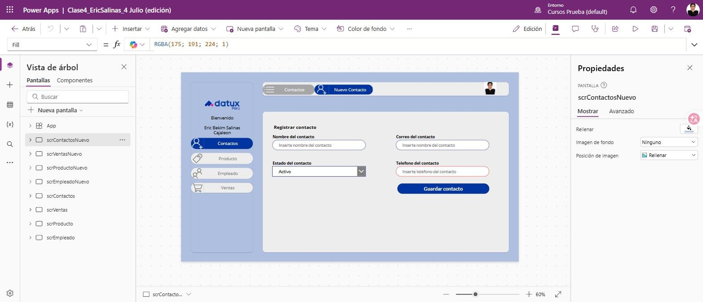 | 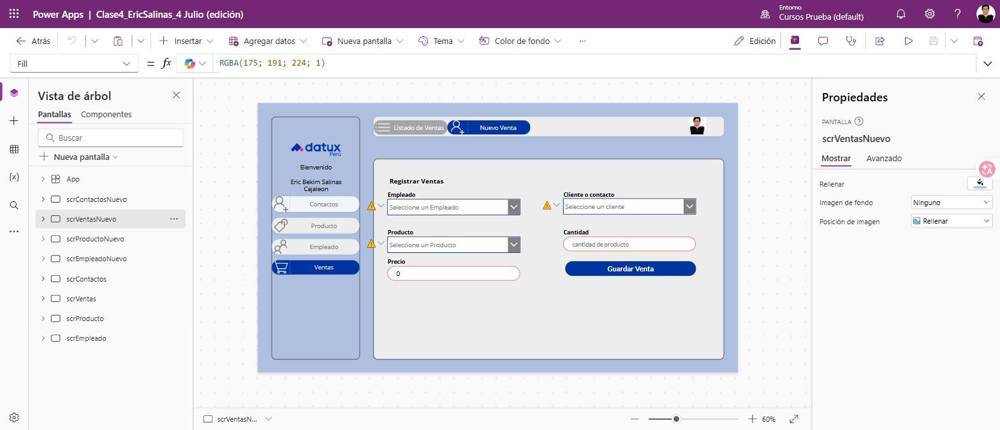 |
| Entradas de texto + lista desplegable alimentada por `Choices()` | Tres cuadros combinados con búsqueda + precio total calculado solo |

| Registrar producto | Registrar empleado |
|---|---|
| 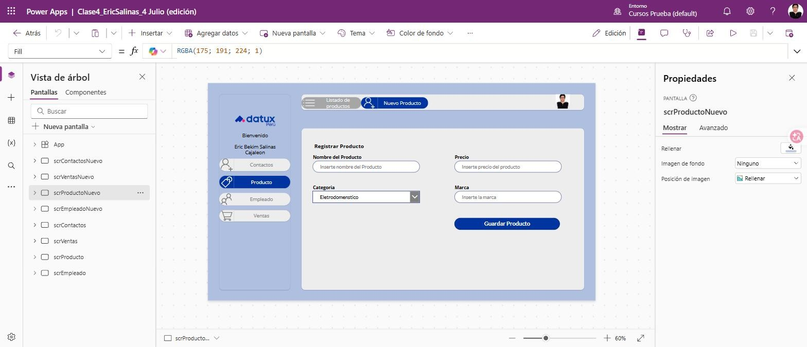 | 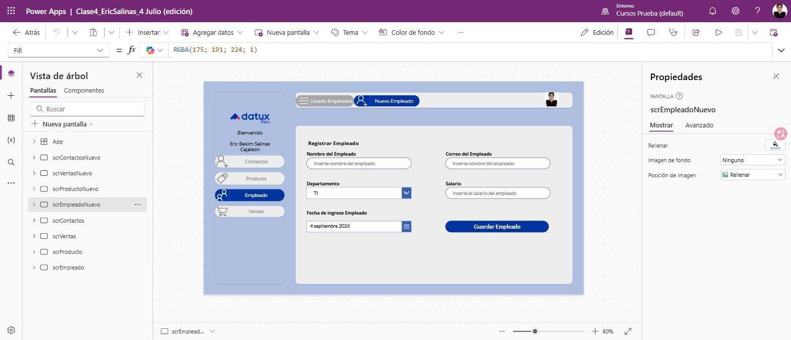 |
| Categoría por elección, precio en moneda | Departamento por elección, salario en moneda, selector de fecha |

### Pantallas de consulta

| Listado de contactos | Listado de ventas |
|---|---|
| 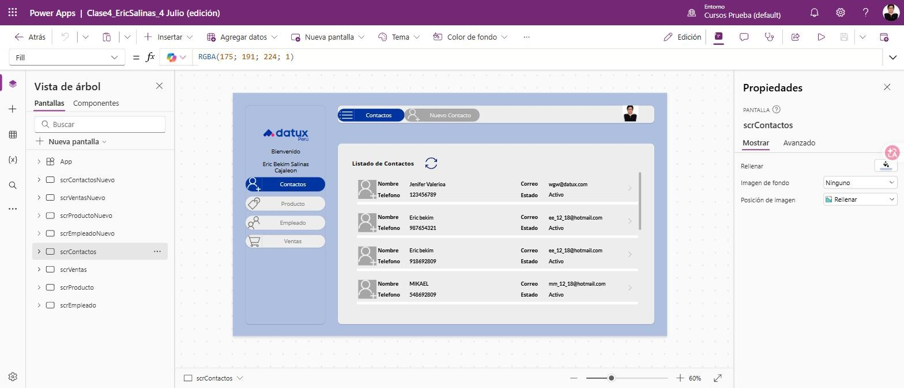 | 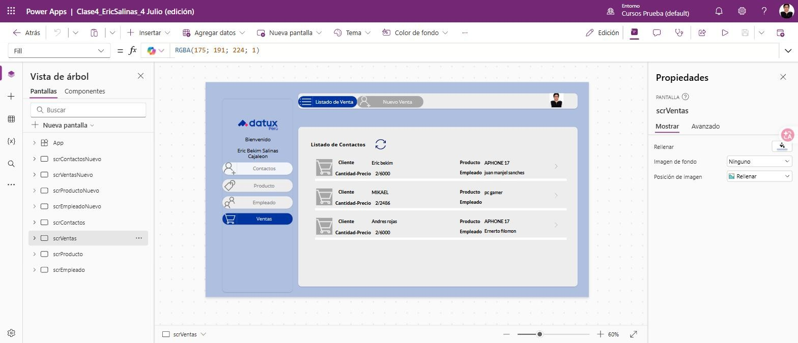 |
| Galería vertical sobre `Contactos` con ícono de refresco | **Aquí está lo interesante:** los IDs se resuelven a nombres con `LookUp` |

| Listado de productos | Listado de empleados |
|---|---|
| 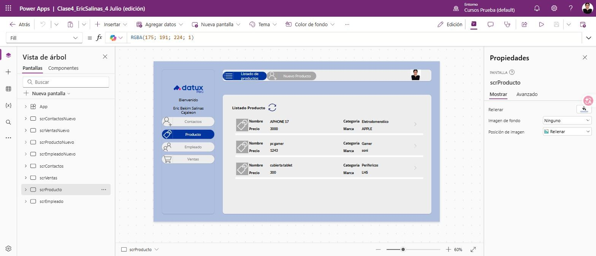 | 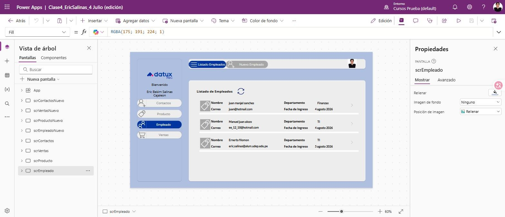 |

---

## 3. Modelo de datos en SharePoint

Cinco listas en el sitio `Practicas_Ericsalinas`. **Ventas** es la tabla de hechos; las otras tres
son dimensiones. `Capacitaciones` alimenta el flujo programado de recordatorios.

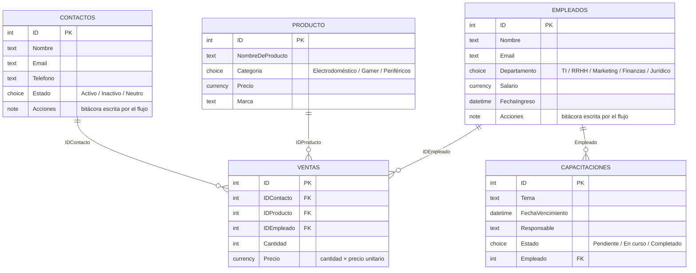

### Las listas con datos reales cargados desde la app

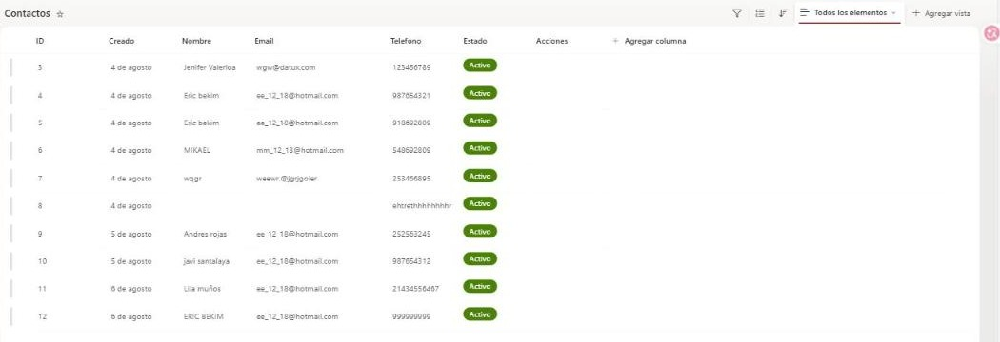

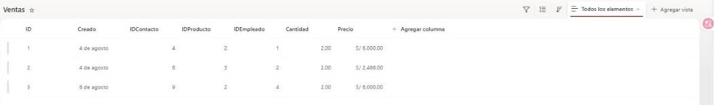

> Fíjate en la tabla `Ventas`: **solo números**. `IDContacto = 4`, `IDProducto = 2`,
> `IDEmpleado = 1`. Ese es el punto — la app nunca guarda el nombre del cliente dentro de la
> venta, guarda su clave. Si mañana el cliente cambia de nombre, el historial de ventas no se
> rompe ni se desactualiza.

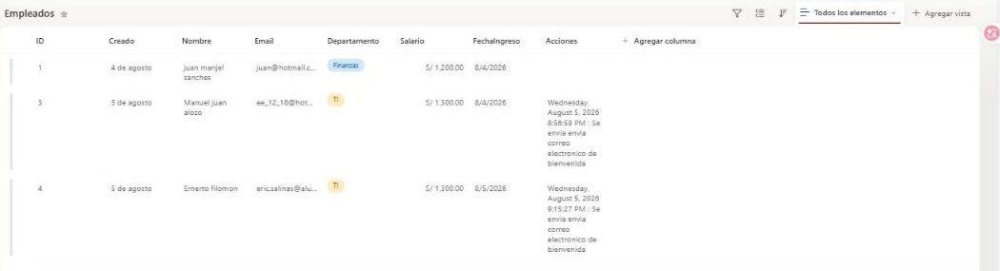

> Y en `Empleados`, la columna **Acciones** tiene texto que **ningún humano escribió**:
> `Wednesday, August 5, 2026 8:56:59 PM : Se envía correo electrónico de bienvenida`.
> Lo escribió el flujo de Power Automate al terminar. Es la bitácora de la automatización
> viviendo dentro del mismo registro.

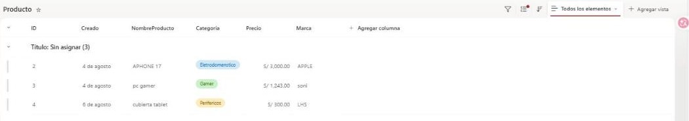

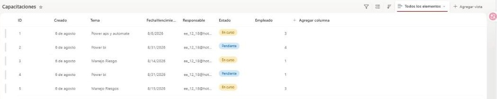

---

## 4. Cómo está construida (Power Fx)

### 4.1 El patrón de guardado: cuatro acciones, siempre las mismas

Cada botón *Guardar* hace exactamente cuatro cosas, en este orden. Que sea idéntico en las
cuatro pantallas es deliberado: quien mantenga la app después no tiene que aprender cuatro
comportamientos distintos.

```powerfx
// btnGuardarContacto.OnSelect
Patch(
    Contactos;
    Defaults(Contactos);
    {
        Nombre:   txtNombreContacto.Text;
        Email:    txtCorreoContacto.Text;
        Telefono: txttelefonoContacto_1.Text;
        Estado:   { Value: ddEstadoContacto.Selected.Value }
    }
);;
Notify("Contacto Registrado con exito"; NotificationType.Success);;
Reset(txtNombreContacto) && Reset(txtCorreoContacto) && Reset(txttelefonoContacto_1);;
Navigate(scrContactos)
```

| Paso | Función | Para qué |
|---|---|---|
| 1 | `Patch(… Defaults(…) …)` | Crea un registro **nuevo** (no edita uno existente) |
| 2 | `Notify(…)` | Confirma al usuario que se guardó — sin esto no hay señal de éxito |
| 3 | `Reset(…)` | Limpia los campos para el siguiente registro |
| 4 | `Navigate(…)` | Lleva al listado, donde el usuario **ve** lo que acaba de crear |

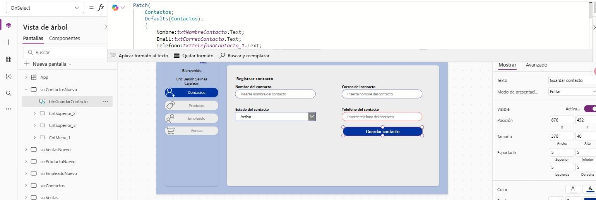

### 4.2 La venta: claves foráneas desde cuadros combinados

Aquí está la diferencia entre un formulario y un sistema. El usuario elige *"Eric bekim"* en un
combo box, pero lo que viaja a SharePoint es `4`.

```powerfx
// btnGuardarVenta.OnSelect
Patch(
    Ventas;
    Defaults(Ventas);
    {
        IDContacto: CbContacto.Selected.ID;
        IDProducto: CbProducto.Selected.ID;
        IDEmpleado: CbEmpleado.Selected.ID;
        Cantidad:   Value(txtCantidad.Text);
        Precio:     Value(txtPrecio1.Text)
    }
);;
Notify("Venta guardada con éxito."; NotificationType.Success);;
Reset(txtCantidad) & Reset(CbContacto) & Reset(CbProducto) & Reset(CbEmpleado);;
Navigate(scrVentas)
```

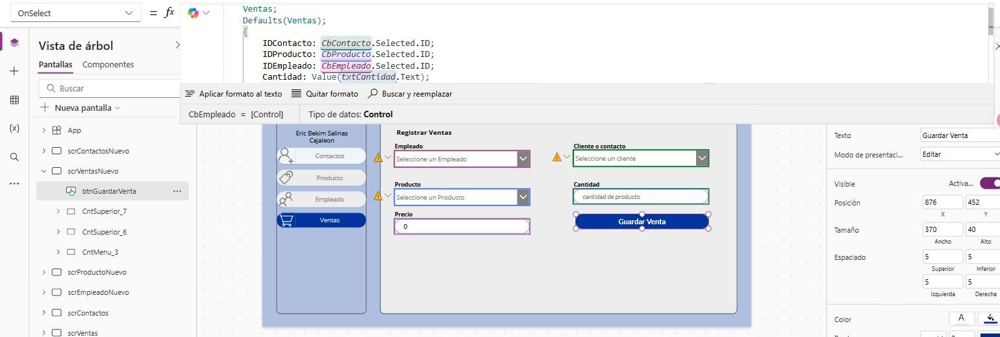

### 4.3 El precio no se escribe: se calcula

El campo *Precio* de la pantalla de venta no es un campo de captura, es un resultado. Su
propiedad `Default` multiplica la cantidad tecleada por el precio unitario del producto elegido:

```powerfx
// txtPrecio1.Default
Value(txtCantidad.Text) * CbProducto.Selected.Precio
```

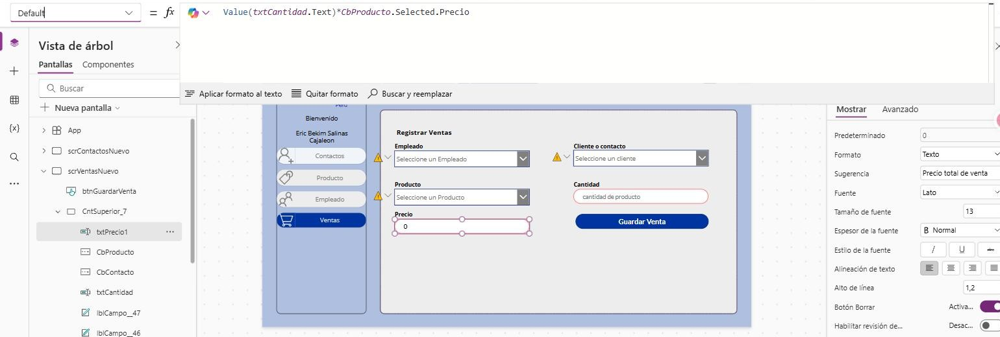

**Por qué importa:** es el error clásico de un registro de ventas en Excel — alguien teclea el
total mal y nadie lo nota hasta el cierre de mes. Al derivarlo del catálogo, el total no puede
contradecir al precio de lista.

### 4.4 La galería que deshace las claves

La pantalla de ventas hace el camino inverso: recibe IDs y muestra nombres.

```powerfx
// galContacto_1.Items
Ventas

// Etiqueta "Cliente" dentro de la galería
LookUp(Contactos; ID = ThisItem.IDContacto).Nombre

// Etiqueta "Producto"
LookUp(Producto;  ID = ThisItem.IDProducto).NombreDeProducto

// Etiqueta "Empleado"
LookUp(Empleados; ID = ThisItem.IDEmpleado).Nombre
```

Es un *join* hecho a mano en la capa de presentación. En la captura del
[listado de ventas](IMAGENES/06-app-listado-ventas.jpg) se ve el resultado: *Eric bekim ·
APHONE 17 · juan manjel sanches*, tres tablas distintas reconstruidas en una sola fila.

### 4.5 Detalles que no se ven pero sostienen la app

| Técnica | Dónde | Qué resuelve |
|---|---|---|
| `Choices(Contactos.Estado)` | Listas desplegables | Las opciones salen de SharePoint, no están escritas a mano en la app. Si RRHH agrega un estado nuevo, aparece sin tocar código |
| `Items = Producto` + campo de búsqueda | Cuadros combinados | Búsqueda por contenido, no exacta: escribir `26` encuentra todo lo que lo contenga |
| Contenedores anidados (`CntMenu`, `CntSuperior`) | Las 8 pantallas | El menú y la cabecera se copian entre pantallas como bloque, no control por control |
| Nomenclatura `scr` / `cnt` / `txt` / `lbl` / `cb` / `dd` / `btn` / `gal` | Todo el árbol | Ningún control se llama `TextInput1`. En un `Patch` de 6 campos, saber qué estás enviando es la diferencia entre depurar en 1 minuto o en 20 |
| Variable global `empleadoSP` | Nivel de app | Contexto del usuario/empleado en sesión |

---

## 5. Automatizaciones (Power Automate)

Cuatro flujos en la nube, cada uno con un **disparador distinto** — que es justamente el punto:
la misma plataforma reacciona a un evento de datos, a una acción del usuario, a un formulario
externo o al reloj.

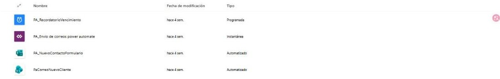

| Flujo | Tipo | Disparador | Qué hace |
|---|---|---|---|
| **PaCorreoNuevoCliente** | Automatizado | *Cuando se crea un elemento* (SharePoint) | Envía el correo de bienvenida y **escribe la marca de tiempo en la columna `Acciones`** del mismo registro |
| **PA_Envío de correos** | Instantáneo | *Cuando Power Apps llama a un flujo (V2)* | La app dispara el correo bajo demanda; convierte zona horaria antes de sellar la bitácora |
| **PA_NuevoContactoFormulario** | Automatizado | *Cuando se envía una respuesta nueva* (Microsoft Forms) | Alta de contactos desde un formulario público, sin entrar a la app |
| **PA_RecordatorioVencimiento** | Programado | *Recurrence* | Recorre `Capacitaciones` y avisa de las que están por vencer |

### Los cuatro flujos

| Correo al crear cliente | Correo llamado desde la app |
|---|---|
| 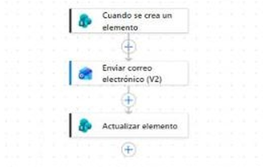 | 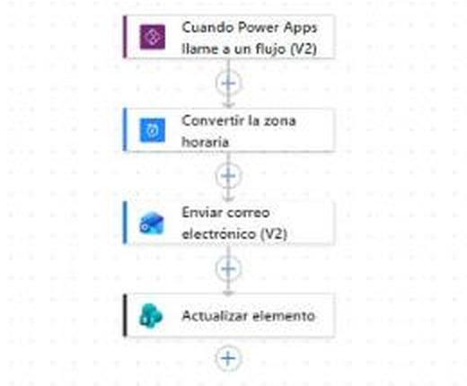 |
| Trigger de datos → correo → **actualizar elemento** | Trigger desde Power Apps → zona horaria → correo → bitácora |

| Formulario externo → SharePoint | Recordatorio programado |
|---|---|
| 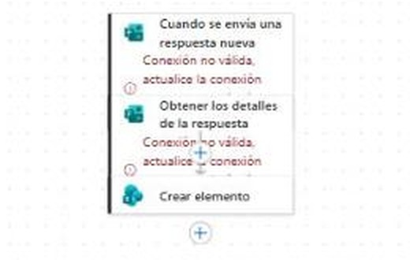 | 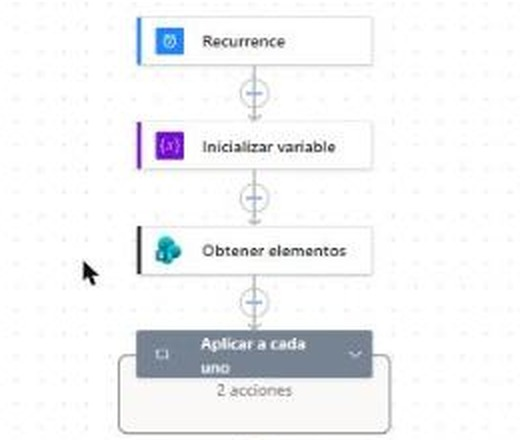 |
| Forms → detalle de la respuesta → crear elemento | Reloj → variable de días restantes → obtener elementos → **Aplicar a cada uno** |

> **El detalle que más me gusta de estos flujos:** los dos de correo no terminan en *"enviar"*.
> Terminan en **Actualizar elemento**, escribiendo en la lista qué se envió y cuándo. Un flujo
> que solo manda correos es invisible cuando falla; uno que deja rastro en el propio registro se
> puede auditar sin abrir el historial de ejecuciones.

---

## 6. Decisiones de diseño

| Decisión | Alternativa descartada | Razón |
|---|---|---|
| **IDs numéricos como clave foránea** en `Ventas` | Guardar el nombre del cliente como texto | El nombre cambia, el ID no. Y evita el clásico *"Eric bekim"* vs *"ERIC BEKIM"* como dos clientes distintos |
| **Precio calculado en la propiedad `Default`** | Campo libre que el usuario teclea | El total no puede contradecir al catálogo |
| **`Choices()` contra la columna de SharePoint** | Opciones escritas dentro de la app | El catálogo de opciones vive en un solo sitio |
| **`Reset()` + `Navigate()` después de guardar** | Dejar el formulario lleno | Evita duplicados por doble clic y le muestra al usuario el efecto de lo que hizo |
| **Bitácora en la lista (`Actualizar elemento`)** | Confiar en el historial de ejecuciones de Power Automate | La evidencia queda junto al dato, visible para cualquiera con acceso a la lista |
| **Contenedores para menú y cabecera** | Copiar controles sueltos entre pantallas | Un cambio de diseño se replica, no se repite ocho veces |

---

## 7. Limitaciones y qué haría distinto

Esto es un entregable de curso, no un sistema en producción. Lo que le falta, dicho por mí antes
de que lo diga otro:

- **`LookUp` por fila en la galería no escala.** Con 3 ventas es instantáneo; con 5 000 son tres
  consultas por fila visible. La solución correcta es una **columna de búsqueda nativa de
  SharePoint** (tipo *Lookup*) o precargar las dimensiones en una colección con `ClearCollect`
  en `OnVisible`.
- **Límite de delegación de SharePoint (2 000 registros).** Ninguna galería filtra ni ordena en
  origen todavía; con volumen real habría que revisar qué queda delegable.
- **No hay validación de obligatoriedad.** Hoy se puede guardar un contacto sin nombre — de
  hecho hay un registro así en la lista. Faltan `If(IsBlank(…))` antes del `Patch` y
  `DisplayMode` condicional en el botón.
- **Deuda en el esquema.** `Producto` arrastra dos columnas de nombre (`NombreDeProducto` y
  `NombreProducto`) de una iteración anterior, y las opciones de categoría tienen errores de
  tipeo (*Eletrodomenstico*, *Perifericos*). En un sistema real se corrigen antes de cargar datos,
  porque después ya hay registros apuntando a esos valores.
- **Sin control de errores.** `Patch` no está envuelto en `IfError` ni escribe a `App.OnError`.
- **Sin roles.** Cualquier usuario con la app puede registrar ventas y ver salarios.

---

## 📌 Trazabilidad

| Dato | Valor |
|---|---|
| **Formación** | Microsoft Power Apps y Power Automate — **Datux Perú** (Microsoft Partner Network) |
| **Periodo** | Julio – agosto 2026 · 6 sesiones |
| **Entorno** | *Cursos Prueba* (Power Platform) · sitio SharePoint `Practicas_Ericsalinas` |
| **Aplicación** | Canvas app · 8 pantallas · 5 listas · 4 flujos |
| **Alcance propio** | Las pantallas de **Producto**, **Empleado** y **Ventas** y sus fórmulas se replicaron y adaptaron como trabajo asignado, sobre el patrón visto en clase para **Contactos** |

---

<div align="center">

[⬅️ Volver al portafolio principal](../../README.md)

</div>
