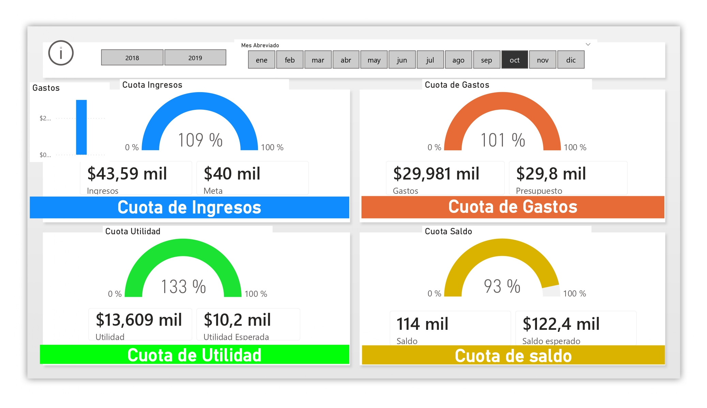
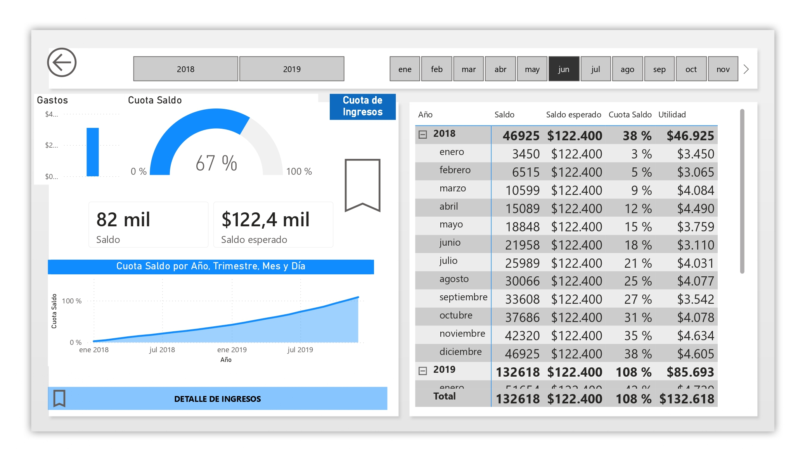

# 📊 Análisis Gerencial y Control Presupuestario (2018-2019)

---

## 🎯 Objetivo de Negocio y Alcance
Este proyecto desarrolla un **Dashboard Integral de Inteligencia de Negocios** diseñado para monitorear, controlar y analizar los KPIs financieros clave de una organización durante un periodo de dos años.

El objetivo principal es proporcionar a la alta gerencia una herramienta de toma de decisiones estratégicas que permita:
* Evaluar el cumplimiento de **metas de ingresos** y márgenes de utilidad.
* Controlar desviaciones críticas en el **presupuesto de gastos**.
* Asegurar la **liquidez mensual** mediante alertas tempranas en el flujo de caja.

---

## 📋 Resumen Ejecutivo y Vitrina Visual

> ***Takeaway Clave:*** Como se evidencia en el análisis consolidado, la organización logró un desempeño sobresaliente en rentabilidad (alcanzando un **108% de la utilidad esperada total**). Esto fue impulsado por un control efectivo de costos fijos y un sobrecumplimiento en la cuota de ingresos de segmentos clave. Sin embargo, el análisis de flujo de caja detectó alertas críticas de liquidez en periodos específicos que requieren atención operativa.

---

### 1. Vista de Resumen Gerencial ("El Pulso")


* **Insight:** Se observa una **utilidad estelar del 133%** en el periodo filtrado, logrando $13,609 mil sobre una meta de $10,2 mil.

### 2. Vista de Alerta de Liquidez ("La Alerta")


* **Insight Crítico:** En Junio '19, el saldo actual fue de solo $82 mil sobre un esperado de $122.4 mil (**67% de cumplimiento**).

---

## 🧠 Arquitectura de Medidas DAX (Lógica de Ingeniería)

El modelo de datos se basa en una estructura de capas (Agregación, Lógica de Negocio, Inteligencia de Tiempo y KPIs), garantizando que los cálculos sean modulares y escalables.

```dax
// 1. CAPA DE AGREGACIÓN (Factores Base)
Total Finanzas = SUM(Finanzas[Cantidad])
Total Expectativa = SUM(Expectativas[Cantidad])

// 2. CAPA DE LÓGICA DE NEGOCIO (Filtrado Dinámico)
Ingresos = CALCULATE([Total Finanzas], Finanzas[Tipos] = "Ingresos")
Gastos = CALCULATE([Total Finanzas], Finanzas[Tipos] = "Gastos")
Meta = CALCULATE([Total Expectativa], Expectativas[Tipo] = "Metas")
Presupuesto = CALCULATE([Total Expectativa], Expectativas[Tipo] = "Presupuesto")

// 3. CAPA DE INTELIGENCIA AVANZADA (Running Totals / Cash Flow)
Saldo = CALCULATE([Utilidad], FILTER(ALL(Finanzas), Finanzas[Fecha] <= MAX(Finanzas[Fecha])))
Saldo esperado = CALCULATE([Utilidad Esperada], FILTER(ALL(Expectativas), Expectativas[Fecha] <= MAX(Expectativas[Fecha])))

// 4. CAPA DE INDICADORES DE GESTIÓN (KPIs Finales)
Cuota Ingresos = DIVIDE([Ingresos], [Meta], 0)
Cuota de Gastos = DIVIDE([Gastos], [Presupuesto], 0)
Cuota Utilidad = DIVIDE([Utilidad], [Utilidad Esperada], 0)
Cuota Saldo = DIVIDE([Saldo], [Saldo esperado], 0)
