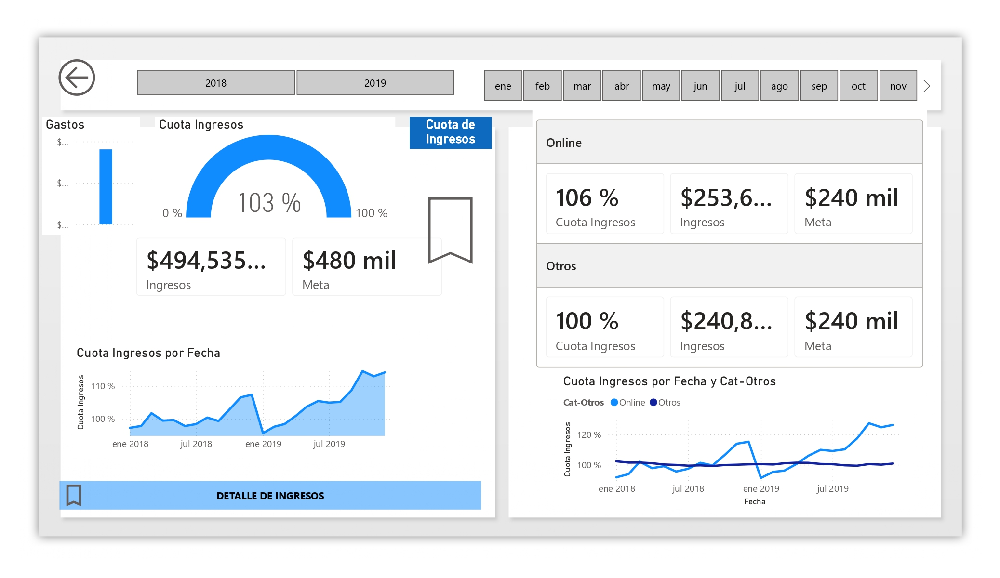
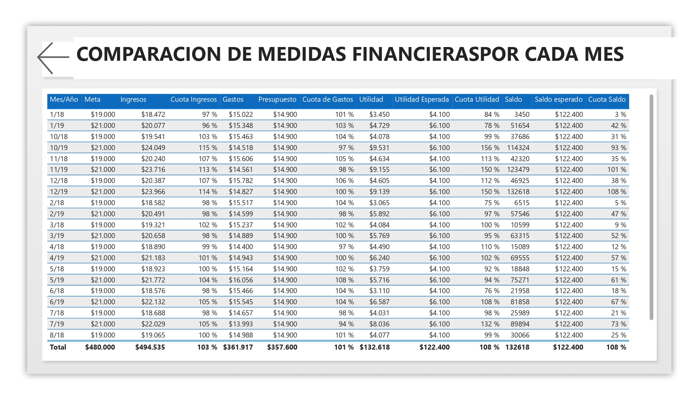

# 📊 Análisis Gerencial y Control Presupuestario (2018-2019)

---

## 🎯 Objetivo de Negocio y Alcance
Este proyecto desarrolla un **Dashboard Integral de Inteligencia de Negocios** diseñado para monitorear, controlar y analizar los KPIs financieros clave de una organización durante un periodo de dos años.

El objetivo principal es proporcionar a la alta gerencia una herramienta de toma de decisiones estratégicas que permita:
* Evaluar el cumplimiento de **metas de ingresos** y márgenes de utilidad.
* Controlar desviaciones críticas en el **presupuesto de gastos**.
* Asegurar la **liquidez mensual** mediante alertas tempranas en el flujo de caja.

---

## 📋 Resumen Ejecutivo y Vitrina Visual

> ***Takeaway Clave:*** Como se evidencia en el análisis consolidado, la organización logró un desempeño sobresaliente en rentabilidad (alcanzando un **108% de la utilidad esperada total**). Esto fue impulsado por un control efectivo de costos fijos y un sobrecumplimiento en la cuota de ingresos de segmentos clave. Sin embargo, el análisis de flujo de caja detectó alertas críticas de liquidez en periodos específicos que requieren atención operativa.

A continuación, se presenta la navegación detallada por las distintas vistas del reporte interactivo:

---

### 1. Vista de Resumen Gerencial ("El Pulso")
Esta página ofrece una instantánea inmediata del pulso financiero de la empresa.

* **Descripción:** Cuatro *Gauges* (Medidores) dinámicos que muestran el % de cumplimiento de la cuota de Ingresos, Gastos, Utilidad y Saldo, comparando el monto actual vs. el presupuesto/meta.
* **Insight Demostrado (Filtro Octubre - Total 2018+2019):** Se observa una **utilidad estelar del 133%**, logrando $13,609 mil sobre una meta de $10,2 mil, a pesar de que los gastos están ligeramente por encima del presupuesto (101%).

---

### 2. Vista de Control de Ingresos y Canales ("La Fuente")
Permite un desglose pormenorizado de las fuentes de entrada de dinero.

* **Descripción:** Análisis temporal de ingresos con tendencias (Mes Anterior vs. Mes Actual) y matrices jerárquicas para desglosar por categorías clave (Remuneración vs. Otros Canales).
* **Valor Técnico:** Demuestra la capacidad de gestionar **modelos de datos complejos** con filtros cruzados entre categorías transaccionales.

---

### 3. Vista de Alerta de Liquidez y Cashflow ("La Alerta")
Monitoriza la capacidad de la empresa para cubrir sus compromisos a corto plazo.

* **Descripción:** Un medidor de cumplimiento de saldo global y un gráfico de área temporal que compara el Saldo Esperado vs. el Saldo Actual a lo largo del tiempo.
* **CRITICAL INSIGHT DETECTADO (Filtro Junio 2019):** **PUNTO CRÍTICO OPERATIVO**. En Junio '19, el saldo actual fue de solo $82 mil sobre un esperado de $122.4 mil (**67% de cumplimiento**). Esta vista es una herramienta clave de alerta temprana para la tesorería.

---

### 4. Vista Consolidada de Auditoría ("La Tabla Maestra")
La "fuente única de verdad" con todos los datos crudos consolidados para revisión técnica.

* **Descripción:** Una matriz exhaustiva que lista cada mes de 2018 y 2019 con todas las métricas financieras: Meta de Ingresos vs. Ingresos Actuales ($), Presupuesto de Gastos vs. Gastos Actuales ($), Utilidad Esperada vs. Utilidad Actual ($) y Saldo vs. Saldo Esperado ($).
* **Valor de Ingeniería:** Demuestra la capacidad de **limpieza (ETL), modelado y consolidación** de múltiples *streams* de datos transaccionales en una única tabla de verdad auditables.

---

## 🛠️ Stack Tecnológico y Habilidades
* **Power BI:** Visualización de datos avanzado y storytelling.
* **DAX Avanzado:** Implementación de medidas dinámicas para cálculos de cumplimiento (Gauges) e inteligencia temporal (Time Intelligence).
* **Power Query (ETL):** Limpieza, transformación y normalización de datos desde archivos transaccionales Excel.
* **Modelado de Datos:** Diseño de estructura de estrella optimizada para filtros cruzados eficientes.

---

## 📂 Contenido del Proyecto
Este proyecto se organiza de la siguiente manera:
* 📁 **`data/`**: Contiene el archivo transaccional Excel original utilizado como fuente de datos.
* 📁 **`IMAGENES/`**: Capturas de pantalla utilizadas en este README para la visualización inmediata.
* 📊 **`Proyecto_Final_BI.pbix`**: Archivo original de Power BI con todo el modelo de datos y las visualizaciones.

---

## 👤 Autor
**Eric Salinas**
* Estudiante de Ingeniería Industrial | Analista de Datos
* [LinkedIn](TU_LINK_DE_LINKEDIN_AQUI)
