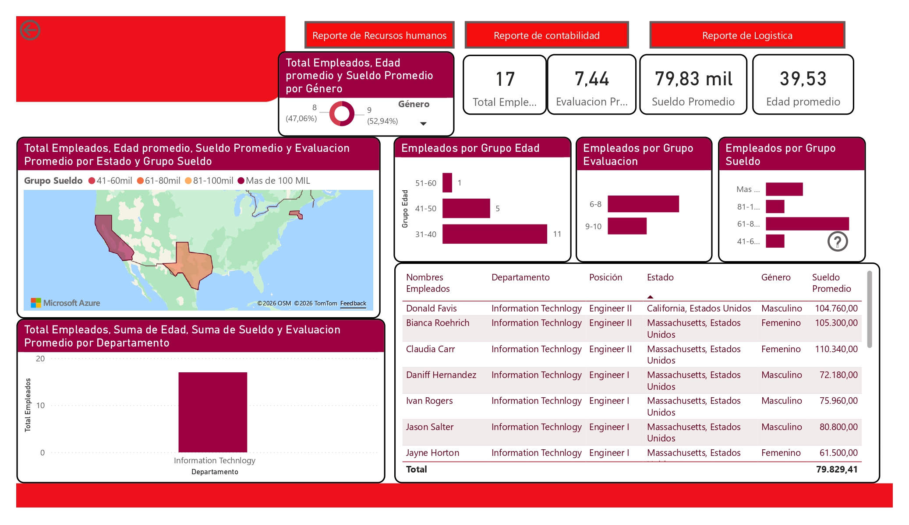
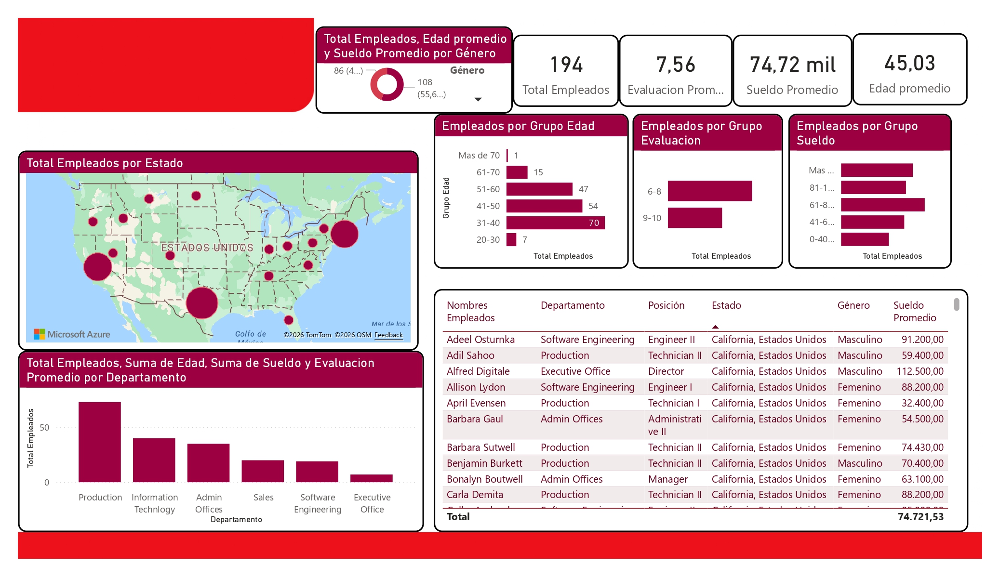
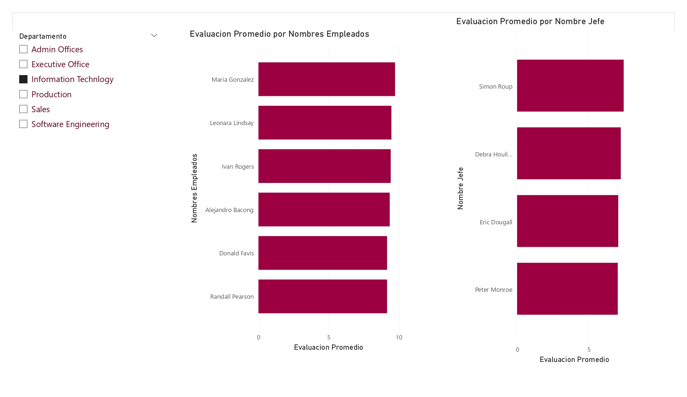

# 👥 Dashboard de Gestión de Talento Humano (HR Analytics)

---

## 🎯 Objetivo del Proyecto
Este dashboard integral de Recursos Humanos permite monitorear la fuerza laboral mediante el análisis de demografía, compensación y desempeño. El objetivo es proporcionar una herramienta de soporte para la toma de decisiones estratégicas en el área de capital humano.

---

## 📋 Vitrina Visual

### 1. Reporte de Recursos Humanos (General)
Vista macro con indicadores de plantilla, sueldos promedio y evaluaciones globales.


### 2. Reporte de Contabilidad y Logística
Segmentación de métricas de costo por departamentos clave.


### 3. Detalle de Desempeño por Liderazgo
Identificación de equipos de alto rendimiento y evaluación promedio por jefe directo.


---

## 🧠 Arquitectura de Medidas DAX (Lógica de Ingeniería)

Para este modelo, implementé una arquitectura de medidas jerárquicas que permite segmentar la población laboral de forma dinámica.

```dax
// 1. MÉTRICAS BASE DE GESTIÓN
Total Empleados = DISTINCTCOUNT(Empleados[Nombre Empleado])
Sueldo Promedio = AVERAGE(Empleados[Sueldo])
Evaluacion Promedio = AVERAGE(Empleados[Evaluacion])

// 2. LÓGICA DE COMPENSACIÓN AVANZADA (Filtrado Combinado)
// Esta medida permite aislar el costo de nómina de IT en estados estratégicos (CA o TX)
Sueldo por IT = 
CALCULATE(
    SUM(Empleados[Sueldo]), 
    Empleados[Departamento] = "Information Technology", 
    Empleados[Estado] = "CA" || Empleados[Estado] = "TX"
)
