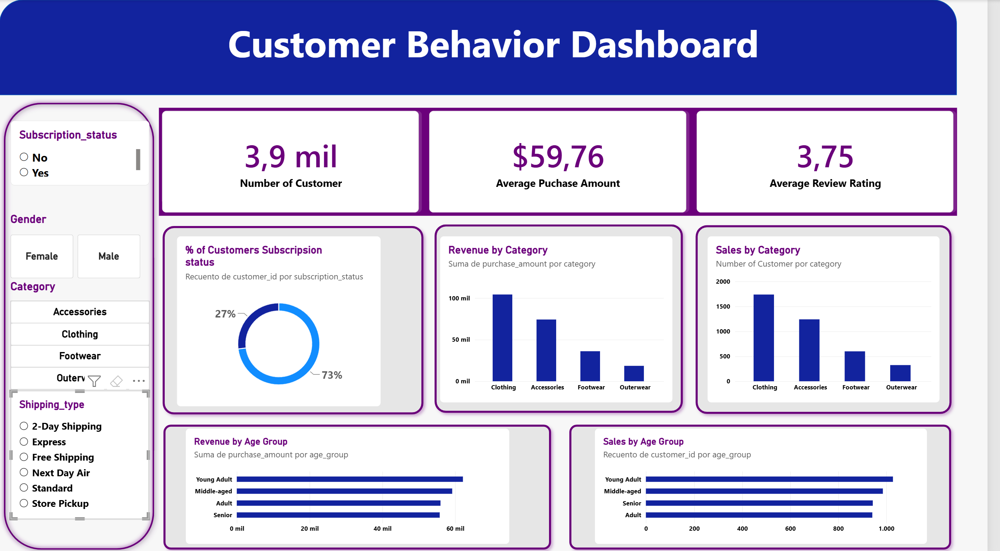
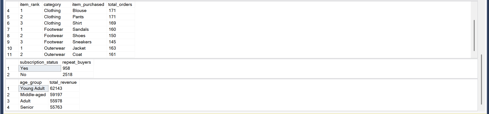
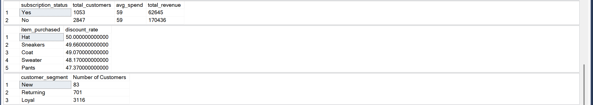

# 🛒 Customer Shopping Behavior — Proyecto end-to-end (Python → SQL Server → Power BI)

### **Eric Salinas Cajaleón** | Ingeniería Industrial y de Sistemas — **Universidad de Piura (UDEP)**

`Python` · `Pandas` · `SQLAlchemy` · `pyodbc` · `SQL Server 2022` · `T-SQL` · `Power BI` · `DAX`

> Ciclo completo de analítica sobre un dataset de comportamiento de compra de **3,900 clientes**:
> preparación y modelado en Python, carga a una base SQL Server creada por código,
> **10 preguntas de negocio** resueltas en T-SQL y un tablero interactivo en Power BI.
>
> El hallazgo que sostiene todo el análisis: **el ticket promedio es prácticamente constante
> ($59.76) en todas las dimensiones del dataset** — género, edad, categoría y suscripción.
> Ninguna de las brechas de ingreso que muestran los gráficos es una brecha de gasto.
> Todas son brechas de volumen.

[⬅️ Volver al portafolio principal](../../README.md)

---

## Índice

| Sección | Qué encontrarás |
|---|---|
| [1. El problema](#1-el-problema) | La pregunta de negocio y los entregables pedidos |
| [2. Arquitectura del proyecto](#2-arquitectura-del-proyecto) | Cómo viaja el dato de un CSV al tablero |
| [3. Preparación en Python](#3-preparación-del-dato-en-python) | Las 5 decisiones de limpieza y por qué cada una |
| [4. Carga a SQL Server](#4-carga-a-sql-server-desde-python) | Creación idempotente de la base y del esquema |
| [5. Las 10 preguntas en SQL](#5-las-10-preguntas-de-negocio-en-t-sql) | Técnica aplicada, resultado y lectura de cada consulta |
| [6. El tablero en Power BI](#6-el-tablero-en-power-bi) | Medidas, segmentadores y criterio de diseño |
| [7. Lo que realmente dice el dato](#7-lo-que-realmente-dice-el-dato) | La lectura de negocio, incluidas las que contradicen el gráfico |
| [8. Recomendaciones](#8-recomendaciones-al-negocio) | Qué haría la empresa con esto |
| [9. Decisiones de diseño](#9-decisiones-de-diseño) | Qué elegí, qué descarté y por qué |
| [10. Limitaciones](#10-limitaciones-y-qué-haría-distinto) | Lectura crítica de mi propio trabajo |
| [11. Cómo reproducirlo](#11-cómo-reproducirlo) | Requisitos y pasos |

---

## 1. El problema

Una empresa retail quiere entender el comportamiento de compra de sus clientes para
**mejorar ventas, satisfacción y lealtad a largo plazo**. La gerencia detectó cambios en los
patrones de compra entre grupos demográficos, categorías de producto y canales, y quiere
saber qué factores —descuentos, reseñas, temporada, método de pago— empujan la decisión
de compra y la recompra.

> **Pregunta rectora:**
> *¿Cómo puede la empresa usar los datos de compra para identificar tendencias, mejorar el
> engagement y optimizar sus estrategias de marketing y producto?*

📄 El enunciado original está en este repositorio: **[Business_Problem_Document.pdf](Business_Problem_Document.pdf)**

**Entregables pedidos:** preparación en Python · análisis en SQL · tablero en Power BI ·
documentación · repositorio estructurado. Este README es la documentación; los cuatro
primeros están en esta carpeta.

### El dataset y su grano

3,900 filas × 18 columnas. **Una fila = un cliente = su última compra.**

| Bloque | Columnas |
|---|---|
| **Identidad y demografía** | `customer_id`, `age`, `gender`, `location` |
| **La compra** | `item_purchased`, `category`, `purchase_amount`, `size`, `color`, `season` |
| **Experiencia** | `review_rating`, `shipping_type`, `payment_method` |
| **Relación comercial** | `subscription_status`, `discount_applied`, `promo_code_used`, `previous_purchases`, `frequency_of_purchases` |

**El límite más importante, y hay que decirlo antes de cualquier número:** el dataset **no trae
historial transaccional ni fecha de compra**. `previous_purchases` es un *contador*, no un
libro mayor: dice cuántas veces compró antes, no qué compró ni por cuánto. Eso significa que:

- `SUM(purchase_amount)` **no es la facturación de la empresa** — es la suma de la última
  compra de cada cliente. Lo llamo "ingreso" por convención, pero es una foto, no un flujo.
- No hay cohortes, ni curvas de retención, ni inteligencia de tiempo. Sin fecha no hay serie.

Esto no es un defecto del ejercicio: es la situación normal en un proyecto real, donde el
cliente entrega lo que tiene o lo que su política le permite compartir. El trabajo del analista
es sacar valor de eso **y decir con precisión hasta dónde llega la conclusión**.

---

## 2. Arquitectura del proyecto

```
customer_shopping_behavior.csv
          │
          ▼
┌─────────────────────────────────────────────────────────┐
│  PYTHON — pandas                                        │
│  • EDA (info, describe, nulos)                          │
│  • Imputación de review_rating por mediana POR CATEGORÍA│
│  • Normalización de nombres a snake_case                │
│  • Feature engineering: age_group, purchase_frequency_days│
│  • Detección y eliminación de columna redundante        │
└─────────────────────────────────────────────────────────┘
          │  SQLAlchemy + pyodbc (ODBC Driver 18, Windows Auth)
          ▼
┌─────────────────────────────────────────────────────────┐
│  SQL SERVER 2022 — base shopping_analysis               │
│  • CREATE DATABASE idempotente desde el propio notebook │
│  • dbo.customer_shopping (3,900 filas)                  │
│  • 10 consultas de negocio: subconsultas, CTEs,         │
│    agregación condicional, funciones de ventana         │
└─────────────────────────────────────────────────────────┘
          │  conector nativo SQL Server
          ▼
┌─────────────────────────────────────────────────────────┐
│  POWER BI — Customer Behavior Dashboard                 │
│  • 3 medidas DAX · 6 visuales · 4 segmentadores         │
└─────────────────────────────────────────────────────────┘
```

**Por qué esta arquitectura y no todo en Python:** porque es la que existe en una empresa.
El dato vive en una base, no en un CSV en el escritorio de alguien. Python limpia y carga,
SQL es donde el analista consulta y donde el siguiente analista va a poder consultar sin
pedirle el notebook a nadie, y Power BI es la capa que abre el gerente. Hacer todo el análisis
en pandas habría dado los mismos números y ninguna de las tres cosas.

---

## 3. Preparación del dato en Python

📓 Notebook completo: **[customer_shopping_analysis.ipynb](customer_shopping_analysis.ipynb)**

Cinco decisiones. Ninguna es automática — cada una tiene una alternativa que descarté.

### 3.1 Los 37 nulos de `review_rating`: mediana **dentro de cada categoría**

```python
df["Review Rating"] = df.groupby("Category")["Review Rating"].transform(
    lambda x: x.fillna(x.median())
)
```

| Decisión | Alternativa descartada | Razón |
| :--- | :--- | :--- |
| **Mediana**, no media | `fillna(df.mean())` | La media se mueve con los extremos; la mediana no. En una escala acotada 1–5 con distribución asimétrica, la media arrastra el centro hacia donde no está la masa de datos |
| **Por categoría**, no global | `fillna(df["review_rating"].median())` | Rellenar con la mediana global le impone a una prenda de *Clothing* la calificación típica de *Footwear*. Es inyectar sesgo en la variable que después se va a analizar |
| **Imputar**, no eliminar | `dropna()` | 37 filas son 0.9% — pero esas filas tienen género, categoría, monto y suscripción válidos. Borrarlas por una columna es tirar 17 campos buenos por uno malo |

> **Honestidad sobre el impacto:** en *este* dataset las medianas por categoría resultaron
> muy parecidas (Clothing 3.72 · Footwear 3.79 · Accessories 3.77 · Outerwear 3.75), así que
> el resultado numérico habría sido casi idéntico con la mediana global. **El criterio sigue
> valiendo**: no lo sabía antes de agrupar, y en un dataset donde las categorías sí difieren,
> la mediana global habría contaminado el análisis. Verificar que una decisión correcta
> importó poco no la convierte en innecesaria.

### 3.2 Nombres de columna a `snake_case`

```python
df.columns = df.columns.str.lower()
df.columns = df.columns.str.replace(" ", "_")
df = df.rename(columns={"purchase_amount_(usd)": "purchase_amount"})
```

`Purchase Amount (USD)` obliga a escribir corchetes en Python y `[ ]` en T-SQL en cada
consulta, y los paréntesis rompen el nombre al pasar por SQLAlchemy. Un nombre en
`snake_case` sobrevive intacto a las tres capas del proyecto. **Es la decisión que hace posible
que el mismo nombre de columna funcione en el notebook, en SSMS y en el modelo de Power BI.**

### 3.3 `age_group` con cuartiles, no con cortes redondos

```python
labels = ["Young Adult", "Adult", "Middle-aged", "Senior"]
df["age_group"] = pd.qcut(df["age"], q=4, labels=labels)
```

`qcut` corta por **cuantiles**: cuatro grupos de ~975 clientes cada uno.
La alternativa obvia —cortar en 18-30 / 31-45 / 46-60 / 60+ con `pd.cut`— produce grupos de
tamaños muy distintos, y entonces "el grupo X genera más ingreso" solo significa "el grupo X
tiene más gente". Con grupos del mismo tamaño, **una diferencia de ingreso es una diferencia
de ticket promedio**, que es lo que el negocio quiere saber. Ver [P10](#p10--ingreso-por-grupo-de-edad).

*Contrapartida honesta:* los cortes quedan atados a la distribución de este dataset, no a una
definición de negocio. No son comparables contra otra base de clientes.

### 3.4 `purchase_frequency_days`: de texto a número

```python
frequency_mapping = {
    "Fortnightly": 14, "Weekly": 7, "Monthly": 30, "Quarterly": 90,
    "Bi-Weekly": 14, "Annually": 365, "Every 3 Months": 90
}
df["purchase_frequency_days"] = df["frequency_of_purchases"].map(frequency_mapping)
```

`"Weekly"` no se puede promediar, ordenar ni usar en un eje. `7` sí. El mapeo también
**colapsa duplicados semánticos** que el dataset traía por separado: `Fortnightly` y `Bi-Weekly`
son ambos 14 días; `Quarterly` y `Every 3 Months` son ambos 90. Como texto eran cuatro
categorías distintas y habrían dividido cualquier agrupación en cuatro barras cuando en
realidad son dos comportamientos.

### 3.5 La columna redundante: verificar antes de borrar

```python
(df["discount_applied"] == df["promo_code_used"]).all()   # → True
df = df.drop("promo_code_used", axis=1)
```

A simple vista `discount_applied` y `promo_code_used` parecen lo mismo — pero no tienen por
qué serlo: una empresa puede aplicar descuentos automáticos de temporada sin código promocional.
**Podían diferir. Había que comprobarlo, no suponerlo.**

La comparación devolvió `True` en las **3,900 filas**: correlación perfecta, información
duplicada, cero valor analítico en mantener ambas. Se elimina una.

> **El detalle que importa es el orden:** primero la prueba, después el `drop`. Borrar por
> intuición y acertar es suerte; verificar y borrar es método. Si hubiera dado `False`, la
> diferencia entre ambas columnas habría sido *un hallazgo* — la traza de los descuentos
> automáticos frente a los códigos promocionales.

---

## 4. Carga a SQL Server desde Python

Este es el puente del proyecto. No se creó la base a mano en SSMS: **la crea el propio notebook**.

```python
master_engine = create_engine(
    f"mssql+pyodbc://@{SERVER}/master"
    "?driver=ODBC+Driver+18+for+SQL+Server"
    "&trusted_connection=yes&TrustServerCertificate=yes",
    isolation_level="AUTOCOMMIT"
)

with master_engine.connect() as conn:
    conn.execute(text(
        f"IF NOT EXISTS (SELECT * FROM sys.databases WHERE name = '{DATABASE}') "
        f"CREATE DATABASE [{DATABASE}]"
    ))
```

| Detalle técnico | Por qué está ahí |
| :--- | :--- |
| Conexión primero a **`master`** | No se puede crear una base estando conectado a una base que todavía no existe. Hay que entrar por la base de sistema |
| **`isolation_level="AUTOCOMMIT"`** | `CREATE DATABASE` es una sentencia que SQL Server **no permite dentro de una transacción**. Sin AUTOCOMMIT, SQLAlchemy abre transacción por defecto y la instrucción falla |
| **`IF NOT EXISTS`** | Hace el notebook **idempotente**: se puede re-ejecutar de arriba a abajo sin errores ni efectos duplicados. Un notebook que solo corre bien la primera vez no es un pipeline, es un accidente afortunado |
| **`trusted_connection=yes`** | Autenticación integrada de Windows: **no hay usuario ni contraseña escritos en el notebook**. No hay credencial que se filtre al subir el repositorio a GitHub |
| **`ODBC Driver 18`** | Es el driver vigente; el 17 está en fin de soporte. El 18 exige cifrado por defecto — de ahí `TrustServerCertificate=yes` para una instancia local sin certificado de CA |

```python
df.to_sql("customer_shopping", con=engine, if_exists="replace", index=False)
# → Tabla customer_shopping cargada: 3900 filas
```

Y la verificación inmediata, leyendo **desde SQL**, no desde el DataFrame en memoria:

```python
pd.read_sql("SELECT TOP 10 * FROM customer_shopping", con=engine)
```

> **Por qué verifico leyendo de vuelta:** `to_sql` puede terminar sin excepción y aun así haber
> escrito tipos que no sirven. La única prueba de que la carga funcionó es que la base te
> devuelva los datos.

---

## 5. Las 10 preguntas de negocio en T-SQL

💾 Script completo y comentado: **[customer_shopping_analysis.sql](customer_shopping_analysis.sql)**

<p align="center">
  
  <br><em>SSMS · base <code>shopping_analysis</code> · consultas P1–P4 ejecutadas sobre las 3,900 filas</em>
</p>

### Mapa de técnicas

| # | Pregunta | Técnica SQL |
|:--:|:---|:---|
| P1 | Ingresos por género | `GROUP BY` + `SUM` |
| P2 | Clientes con descuento que gastan sobre el promedio | **Subconsulta escalar** en `WHERE` |
| P3 | Top 5 productos por calificación | `TOP` + `CAST` a `numeric` + `ORDER BY` sobre agregado |
| P4 | Ticket promedio: Estándar vs Exprés | Filtro `IN` + `AVG` |
| P5 | ¿Los suscriptores gastan más? | Agregación multi-métrica |
| P6 | Top 5 productos por **tasa** de descuento | **Agregación condicional** (`SUM(CASE WHEN…)`) |
| P7 | Segmentación Nuevo / Recurrente / Leal | **CTE** + `CASE` |
| P8 | Top 3 productos **dentro de cada** categoría | **Función de ventana** `ROW_NUMBER() OVER (PARTITION BY…)` |
| P9 | ¿El comprador recurrente se suscribe? | Filtro + agregación, comparada contra la base |
| P10 | Ingreso por grupo de edad | `GROUP BY` sobre la columna derivada en Python |

---

### P1 · Ingresos por género — y por qué el número engaña

```sql
select gender, SUM(purchase_amount) as revenue
from customer_shopping
group by gender;
```

| gender | revenue |
|---|---|
| Male | **157,890** |
| Female | **75,191** |

La lectura inmediata es "los hombres generan 2.1× más ingreso". **Es falsa**, y este es el
punto más importante de todo el análisis. Cruzando con el `describe()` del notebook, la base
es **2,652 hombres (68.0%) y 1,248 mujeres (32.0%)**. Entonces:

| Segmento | Clientes | Ingreso | **Ticket promedio** |
|:---|---:|---:|---:|
| Masculino | 2,652 (68.0%) | 157,890 (67.7%) | **$59.54** |
| Femenino | 1,248 (32.0%) | 75,191 (32.3%) | **$60.25** |

**Las mujeres gastan 1.2% MÁS por compra que los hombres.** La participación en ingresos
(67.7%) es casi idéntica a la participación en la base (68.0%): el gráfico de barras no está
midiendo comportamiento de gasto, está midiendo **cuánta gente de cada género hay en la base**.

> **Por qué importa:** la conclusión ingenua —"concentrar marketing en hombres, que es
> donde está el dinero"— es exactamente la decisión equivocada. El dato dice lo contrario:
> las mujeres convierten igual o mejor y están **sub-representadas en la base**. No es un
> problema de targeting, es un problema de **adquisición**. Un analista que reporta
> "157,890 vs 75,191" sin dividir entre el conteo le entrega a la gerencia una decisión errónea
> con un gráfico que la respalda.

---

### P2 · Descuento aplicado y aun así gasto sobre el promedio

```sql
select customer_id, purchase_amount
from customer_shopping
where discount_applied = 'Yes'
  and purchase_amount >= (select AVG(purchase_amount) from customer_shopping);
```

Subconsulta **escalar no correlacionada**: se evalúa una sola vez contra toda la tabla y su
resultado ($59.76) se compara contra cada fila. La alternativa —una subconsulta correlacionada—
recalcularía el promedio 3,900 veces para devolver siempre el mismo número.

Identifica al cliente que **usa el cupón pero no venía por el cupón**: gasta por encima del
promedio aun con descuento. Es el segmento sobre el que el descuento está regalando margen.

---

### P3 · Top 5 productos por calificación promedio

```sql
select top 5 item_purchased,
       round(avg(cast(review_rating as numeric(10,2))),2) as "Average Product Rating"
from customer_shopping
group by item_purchased
order by avg(cast(review_rating as numeric(10,2))) desc;
```

| # | item_purchased | Average Product Rating |
|:--:|---|---|
| 1 | Gloves | 3.86 |
| 2 | Sandals | 3.84 |
| 3 | Boots | 3.82 |
| 4 | Hat | 3.80 |
| 5 | Skirt | 3.78 |

El `CAST` a `numeric(10,2)` no es decorativo: fuerza aritmética decimal exacta antes del
redondeo. `AVG` sobre `float` devuelve un valor sujeto a la representación binaria del motor,
y el redondeo puede diferir en el último decimal entre ejecuciones o versiones.

> **Lectura crítica del propio resultado:** el rango completo de este "top 5" va de **3.78 a
> 3.86 — 0.08 puntos** sobre una escala de 5, y la calificación promedio global es 3.75.
> No existe aquí un producto "mejor calificado" en ningún sentido práctico. **Presentar
> este ranking como insight accionable sería vender ruido como señal.** Lo reporto porque
> la pregunta lo pide, y reporto junto a él que la diferencia no es material.

---

### P4 · Envío Estándar vs Exprés

| shipping_type | ticket promedio |
|---|---|
| Express | **60** |
| Standard | **58** |

$2 de diferencia, 3.4%. Sobre ~600 clientes por modalidad y sin una prueba de significancia,
**no tengo evidencia para afirmar que el envío exprés eleve el ticket.** La recomendación de
libro ("invertir en logística rápida") no está sostenida por este número. Ver
[limitaciones](#10-limitaciones-y-qué-haría-distinto).

---

### P5 · ¿Los suscriptores gastan más? — la consulta que define el proyecto

```sql
SELECT subscription_status,
       COUNT(customer_id) AS total_customers,
       ROUND(AVG(purchase_amount),2) AS avg_spend,
       ROUND(SUM(purchase_amount),2) AS total_revenue
FROM customer_shopping
GROUP BY subscription_status
ORDER BY total_revenue, avg_spend DESC;
```

<p align="center">
  
  <br><em>Resultados de P5, P6 y P7 en SSMS</em>
</p>

| subscription_status | total_customers | avg_spend | total_revenue |
|---|---|---|---|
| Yes | 1,053 (27.0%) | **59** | 62,645 |
| No | 2,847 (73.0%) | **59** | 170,436 |

**El gasto promedio es idéntico.** El programa de suscripción **no mueve el ticket**.
La diferencia de ingreso total (170k vs 62k) es, otra vez, puro conteo: hay 2.7× más
no-suscriptores.

Traer las tres métricas —conteo, promedio y suma— **en una sola consulta** es deliberado:
es lo que permite ver de inmediato que la suma se explica por el conteo y no por el promedio.
Con tres consultas separadas, esa relación se pierde.

---

### P6 · Los 5 productos que más dependen del descuento

```sql
SELECT TOP 5 item_purchased,
       ROUND(100.0 * SUM(CASE WHEN discount_applied = 'Yes' THEN 1 ELSE 0 END)/COUNT(*),2) AS discount_rate
FROM customer_shopping
GROUP BY item_purchased
ORDER BY discount_rate DESC;
```

| item_purchased | discount_rate |
|---|---|
| Hat | **50.00 %** |
| Sneakers | 49.66 % |
| Coat | 49.07 % |
| Sweater | 48.17 % |
| Pants | 47.37 % |

Dos detalles técnicos que deciden si la consulta funciona:

- **`SUM(CASE WHEN … THEN 1 ELSE 0 END)`** convierte una condición de texto en un contador.
  Es el patrón de agregación condicional: contar un subconjunto **sin filtrar la tabla**,
  para poder dividirlo entre el total en la misma pasada.
- **`100.0` y no `100`**: con enteros, SQL Server ejecuta la división **antes** de la
  multiplicación y trunca el cociente a `0`. El resultado sería `0.00` en todas las filas.
  El punto decimal fuerza aritmética decimal.

**Es una tasa, no un volumen.** Un ranking por volumen de descuentos solo devolvería los
productos más vendidos. La tasa responde otra pregunta: *¿qué productos necesitan descuento
para venderse?* — que es una pregunta de **margen**, no de ventas.

---

### P7 · Segmentación de clientes

| customer_segment | Number of Customers | % |
|---|---|---|
| New (1 compra previa) | 83 | 2.1 % |
| Returning (2–10) | 701 | 18.0 % |
| **Loyal (>10)** | **3,116** | **79.9 %** |

> **Lectura crítica:** el 80% de la base cae en un solo segmento. **Una segmentación que deja
> a cuatro de cada cinco clientes en la misma caja no segmenta nada.** Los cortes (1 / 2-10 / >10)
> son una regla de negocio razonable en abstracto, pero no están calibrados contra *esta*
> distribución. Lo correcto sería cortar por percentiles de `previous_purchases`, igual que
> hice con `age_group` en Python. Lo dejo como está porque es lo que pedía el enunciado,
> y lo señalo porque entregar una segmentación inservible sin advertirlo es peor que no
> segmentar.

---

### P8 · Top 3 por categoría — y por qué `ROW_NUMBER` y no `RANK`

```sql
WITH item_counts AS (
    SELECT category, item_purchased,
           COUNT(customer_id) AS total_orders,
           ROW_NUMBER() OVER (PARTITION BY category ORDER BY COUNT(customer_id) DESC) AS item_rank
    FROM customer_shopping
    GROUP BY category, item_purchased
)
SELECT item_rank, category, item_purchased, total_orders
FROM item_counts
WHERE item_rank <= 3;
```

<p align="center">
  
  <br><em>Resultados de P8, P9 y P10 en SSMS</em>
</p>

| item_rank | category | item_purchased | total_orders |
|:--:|---|---|---|
| 1 | Clothing | Blouse | **171** |
| 2 | Clothing | Pants | **171** |
| 3 | Clothing | Shirt | 169 |
| 1 | Footwear | Sandals | 160 |
| 2 | Footwear | Shoes | 150 |
| 3 | Footwear | Sneakers | 145 |
| 1 | Outerwear | Jacket | 163 |
| 2 | Outerwear | Coat | 161 |

**La decisión técnica del proyecto está en esas dos primeras filas: Blouse = 171 y Pants = 171.**

| Función | Qué devolvería ante el empate | Efecto sobre `WHERE item_rank <= 3` |
| :--- | :--- | :--- |
| `RANK()` | Blouse → 1, Pants → **1**, Shirt → 3 | Devuelve **4 filas** en Clothing |
| `DENSE_RANK()` | Blouse → 1, Pants → **1**, Shirt → 2 | Devuelve **4 filas** en Clothing |
| **`ROW_NUMBER()`** | Blouse → 1, Pants → **2**, Shirt → 3 | Devuelve **exactamente 3**, que es lo que pide el negocio |

`PARTITION BY category` reinicia la numeración en cada categoría: es lo que convierte
"el top 3 global" en "el top 3 **dentro de cada** categoría".

> **La contrapartida, que hay que declarar:** ante un empate genuino, cuál de los dos queda
> primero es arbitrario — lo decide el plan de ejecución, no el dato. Si el desempate
> importara para el negocio (por ejemplo, para asignar espacio en góndola), habría que añadir
> un criterio explícito: `ORDER BY COUNT(*) DESC, SUM(purchase_amount) DESC`. Elegir
> `ROW_NUMBER` es aceptar arbitrariedad a cambio de un conteo exacto; **es una decisión con
> costo, no una respuesta obviamente correcta**.

---

### P9 · ¿El comprador recurrente se suscribe?

```sql
SELECT subscription_status, COUNT(customer_id) AS repeat_buyers
FROM customer_shopping
WHERE previous_purchases > 5
GROUP BY subscription_status;
```

| subscription_status | repeat_buyers |
|---|---|
| Yes | 958 |
| No | 2,518 |

958 / 3,476 = **27.6 % de penetración entre los compradores recurrentes**.
La penetración en la base general (P5) es **27.0 %**.

**Seis décimas de diferencia. Ser comprador recurrente no predice absolutamente nada sobre
suscribirse.** Y ese es el hallazgo: la lealtad transaccional y la suscripción son, en esta
base, **variables independientes**.

> **Por qué importa:** una consulta aislada devuelve "958 recurrentes suscritos" y suena bien.
> El número solo significa algo **contra el contrafactual**: ¿es más que el promedio de la base?
> No lo es. Ahí es donde una consulta se convierte en un hallazgo — o donde se descarta uno falso.

---

### P10 · Ingreso por grupo de edad

| age_group | total_revenue | ≈ clientes | ticket implícito |
|---|---|---|---|
| Young Adult | 62,143 | ~975 | ~$63.7 |
| Middle-aged | 59,197 | ~975 | ~$60.7 |
| Adult | 55,978 | ~975 | ~$57.4 |
| Senior | 55,763 | ~975 | ~$57.2 |

Aquí es donde paga la decisión del punto [3.3](#33-age_group-con-cuartiles-no-con-cortes-redondos):
como `qcut` hizo los cuatro grupos del **mismo tamaño**, la diferencia de ingreso **sí** es
diferencia de ticket, no de headcount.

Y la diferencia es de **11.4 %** entre el grupo más alto y el más bajo, en un rango de $57 a $64.

> **La edad es un predictor débil del gasto en esta base.** Segmentar la inversión de marketing
> por edad para capturar 11% de diferencia de ticket, cuando la brecha de adquisición por
> género es de 2.1× en volumen, es optimizar la palanca equivocada.

---

## 6. El tablero en Power BI

📦 Archivo: **[Customer_behavior.pbix](Customer_behavior.pbix)** · conectado por conector nativo
a `DESKTOP-NMBIT88 → shopping_analysis → dbo.customer_shopping`

<p align="center">
  
  <br><em>Customer Behavior Dashboard — 3 KPIs, 5 visuales y 4 segmentadores, totalmente interactivo</em>
</p>

### Las 3 medidas DAX

| Medida | Expresión | Decisión |
| :--- | :--- | :--- |
| `Number of Customers` | `COUNT(customer_id)` | **`COUNT`, no `DISTINCTCOUNT`.** El grano de la tabla es un cliente por fila y `customer_id` es la clave primaria: no hay duplicados que colapsar. `DISTINCTCOUNT` daría el mismo número pagando el costo de una tabla hash sin motivo |
| `Average Purchase Amount` | `AVERAGE(purchase_amount)` | Formateada como **moneda USD con 2 decimales**. Sin el formato, la tarjeta muestra `59.76` — un número sin unidad que cada quien interpreta como quiere |
| `Average Review Rating` | `AVERAGE(review_rating)` | Sobre la columna **ya imputada** en Python. Si la imputación se hubiera hecho mal, el error aparece aquí, en la cara del gerente |

**Medidas, no columnas calculadas.** Una columna calculada se materializa fila por fila en el
modelo y ocupa memoria aunque nadie la mire; una medida se evalúa en el contexto de filtro
del visual. Con 4 segmentadores encima, la diferencia entre ambas es la diferencia entre un
tablero que responde al clic y uno que se arrastra.

### Los visuales y qué responde cada uno

| Visual | Pregunta que responde | Consulta SQL equivalente |
| :--- | :--- | :--- |
| 3 tarjetas KPI | 3,900 clientes · $59.76 ticket · 3.75 rating | — |
| Anillo de suscripción | 27% / 73% | P5 |
| Revenue by Category | Clothing domina con ~104k | — |
| Sales by Category | Clothing 1,737 órdenes | — |
| Revenue by Age Group | Young Adult lidera con 62,143 | P10 |
| Sales by Age Group | ~975 clientes por grupo | P10 |

> **Por qué *Revenue* y *Sales* están uno al lado del otro, y no uno solo:** es la traducción
> visual del hallazgo central. **Las dos parejas de gráficos tienen exactamente la misma forma.**
> Si el ingreso de una categoría creciera por ticket y no por volumen, las barras de Revenue y
> las de Sales tendrían proporciones distintas. Son iguales → el ingreso es volumen puro.
> Un solo gráfico de ingreso no deja ver eso; los dos juntos lo hacen obvio sin explicarlo.

### Los 4 segmentadores

`Subscription_status` · `Gender` · `Category` (segmentadores de botón) y `Shipping_type` (lista).

Están agrupados en un panel lateral y no dispersos por el lienzo: el usuario aprende **una vez**
dónde se filtra. Permiten reproducir en vivo casi cualquier consulta del script SQL —
filtrar por `Gender = Female` y leer la tarjeta de ticket promedio es P1, sin escribir SQL.

---

## 7. Lo que realmente dice el dato

Si hay una sola conclusión que llevarse de las 10 consultas y los 6 visuales, es esta:

> ### El ticket promedio es plano. En todas las dimensiones. Sin excepción.

| Dimensión | Rango del ticket promedio | Variación |
|:---|:---|---:|
| **Género** | $59.54 (M) – $60.25 (F) | **1.2 %** |
| **Suscripción** | $59 (sí) – $59 (no) | **0 %** |
| **Categoría** | $57 (Outerwear) – $60 (Clothing) | **5.3 %** |
| **Grupo de edad** | $57.2 (Senior) – $63.7 (Young Adult) | **11.4 %** |
| **Tipo de envío** | $58 (Standard) – $60 (Express) | **3.4 %** |

Ninguna de las cuatro variables demográficas o comerciales del dataset mueve el gasto por
compra de forma material. **Todas las brechas de ingreso que muestran los gráficos son
brechas de volumen**, y el volumen está determinado por la composición de la base:
68% hombres, 73% no suscritos, 44.5% Clothing.

**Consecuencia práctica:** en esta empresa, *quién* compra no explica *cuánto gasta*. Las
palancas disponibles no son de pricing ni de targeting por perfil — son de **adquisición**
(cuánta gente de cada tipo entra) y de **mix** (qué categorías se empujan).

Tres cifras en la misma dirección:

- **Género:** 2,652 hombres vs 1,248 mujeres, con las mujeres gastando 1.2% *más* por compra.
- **Suscripción:** 27% de penetración, sin efecto sobre el ticket ni correlación con la recompra (P9).
- **Concentración:** Clothing + Accessories = **76.3% de las órdenes**, con ticket casi idéntico
  al de las otras dos categorías. El peso de esas categorías es surtido y disponibilidad, no precio.

---

## 8. Recomendaciones al negocio

| # | Recomendación | Sustento en el dato | Prioridad |
|:--:|:---|:---|:---:|
| 1 | **Tratar la brecha de género como un problema de adquisición, no de targeting.** Reasignar inversión de captación hacia el público femenino | Las mujeres son 32% de la base y gastan $60.25 vs $59.54. Llevar su participación de 32% a 40% suma ~**$19k** sobre la misma estructura de ticket, sin tocar precio | 🔴 **Alta** |
| 2 | **Rediseñar o discontinuar el programa de suscripción.** Hoy no justifica su costo | Ticket idéntico entre suscritos y no suscritos (P5) **y** penetración igual entre recurrentes y base general (P9). El programa no eleva gasto ni captura lealtad | 🔴 **Alta** |
| 3 | **Auditar el descuento estructural en Hat, Sneakers, Coat, Sweater y Pants.** Prueba controlada retirando descuento en Hat | ~50% de las unidades de esos cinco productos salen con descuento (P6), con ticket plano en todo el dataset. El descuento no está comprando ticket más alto: está erosionando margen sobre demanda que existía igual | 🟠 Media |
| 4 | **Concentrar surtido y disponibilidad en Clothing y Accessories** | 76.3% de las órdenes, con ticket equivalente al resto: el peso viene de volumen, y el volumen se defiende con quiebre de stock cero, no con precio | 🟠 Media |
| 5 | **No invertir en logística exprés con la evidencia actual.** Pedir antes datos con fecha y costo de envío | $2 de diferencia (3.4%) sin prueba de significancia (P4). No alcanza para justificar CAPEX | 🟡 Baja |
| 6 | **No segmentar marketing por edad.** Reasignar ese esfuerzo a la recomendación 1 | 11.4% de variación de ticket entre grupos de igual tamaño (P10), frente a una brecha de volumen de 2.1× por género | 🟡 Baja |

**Lo que NO recomiendo, y por qué:** ningún plan basado en el ranking de calificaciones (P3).
El rango completo es de 3.78 a 3.86 sobre 3,900 reseñas — es ruido, no diferenciación de producto.

---

## 9. Decisiones de diseño

| Decisión | Alternativa descartada | Razón |
| :--- | :--- | :--- |
| Limpiar en **Python**, analizar en **SQL** | Hacer todo en pandas | El dato queda en una base consultable por cualquiera, no atrapado en un notebook. Es la arquitectura que existe en una empresa |
| **Crear la base desde el notebook** con `IF NOT EXISTS` | Crearla a mano en SSMS | El pipeline es reproducible de punta a punta y re-ejecutable sin romperse. Un paso manual no documentado es un paso que se pierde |
| **Autenticación integrada de Windows** | Usuario y contraseña en el notebook | Cero credenciales en el código. Requisito no negociable para publicar el repositorio |
| **Medidas DAX**, no columnas calculadas | Columnas calculadas en el modelo | Se evalúan en el contexto de filtro; con 4 segmentadores, es la diferencia entre un tablero ágil y uno lento |
| **`COUNT`**, no `DISTINCTCOUNT` | `DISTINCTCOUNT(customer_id)` | El grano es un cliente por fila y la columna es clave primaria: mismo resultado, menos costo |
| **`ROW_NUMBER`**, no `RANK` | `RANK() / DENSE_RANK()` | Garantiza exactamente 3 filas por categoría con los empates reales del dataset (P8) |
| **Revenue y Sales lado a lado** en el tablero | Solo el gráfico de ingresos | Hace visible que el ingreso es volumen y no ticket, sin necesidad de explicarlo |
| **`qcut`** para `age_group` | `cut` con cortes 18-30/31-45/… | Grupos de igual tamaño → las diferencias de ingreso son diferencias de ticket |
| **Verificar** antes de eliminar `promo_code_used` | Eliminarla por parecido | Podían diferir legítimamente. La prueba (`.all() → True`) es lo que convierte la corazonada en decisión |

---

## 10. Limitaciones y qué haría distinto

**Lo que el dataset no permite — y por lo tanto lo que este análisis no puede afirmar:**

1. **No hay fecha de compra.** Sin fecha no hay serie de tiempo, ni estacionalidad, ni cohortes,
   ni curva de retención, ni inteligencia de tiempo en Power BI. La columna `season` da un
   indicio grueso, pero no un eje temporal.
2. **No hay historial transaccional.** `previous_purchases` es un contador, no un libro mayor.
   Por eso **no se puede calcular un RFM real**: no hay *Recency* (falta fecha) ni *Monetary*
   acumulado (solo se conoce el monto de la última compra).
3. **`SUM(purchase_amount)` no es facturación.** Es la suma de la última compra de cada cliente.
   Todos los "ingresos" de este documento se leen con esa etiqueta puesta.
4. **La segmentación de P7 no discrimina:** 80% de la base cae en "Loyal". Lo rehría cortando
   por percentiles de `previous_purchases`, no por umbrales fijos.
5. **Las diferencias pequeñas no están testeadas.** $60 vs $58 en envío (P4), $59.54 vs $60.25
   en género (P1): reportaría un test t o intervalos de confianza antes de llamarlos hallazgo.
   Sin eso, el signo de la diferencia puede ser ruido muestral — y por eso ninguna de mis
   recomendaciones de prioridad alta depende de ellas.
6. **`if_exists="replace"` reescribe la tabla completa** en cada ejecución. Sirve para un
   proyecto de análisis; en producción sería carga incremental con control de duplicados y
   una tabla de auditoría de cargas.
7. **Los `age_group` no son portables.** Al venir de cuantiles, dependen de *esta* distribución
   de edades y no son comparables contra otro dataset.

**Lo que agregaría con acceso al sistema origen:**
una dimensión de fecha para habilitar YTD, MoM y cohortes · costo por unidad para pasar de
ingreso a **margen** (y así medir de verdad el efecto del descuento de P6) · canal de
adquisición para cerrar el bucle de la recomendación 1 · y una tabla de transacciones real
que convierta `previous_purchases` en un histórico consultable.

---

## 11. Cómo reproducirlo

**Requisitos**

```bash
pip install pandas sqlalchemy pyodbc
```

Además: **SQL Server 2022** (o 2019+), **ODBC Driver 18 for SQL Server**, **SSMS** y **Power BI Desktop**.

**Pasos**

1. Colocar `customer_shopping_behavior.csv` junto al notebook.
2. Abrir `customer_shopping_analysis.ipynb` y ajustar `SERVER` a tu instancia
   (en este proyecto: `DESKTOP-NMBIT88`).
3. Ejecutar el notebook completo. Crea la base `shopping_analysis`, carga las 3,900 filas y
   verifica la carga leyendo de vuelta desde SQL. **Es idempotente: se puede re-ejecutar.**
4. Abrir `customer_shopping_analysis.sql` en SSMS contra `shopping_analysis` y ejecutar las
   10 consultas.
5. Abrir `Customer_behavior.pbix` y actualizar la cadena de conexión al servidor local.

> El CSV original no se versiona en este repositorio. El notebook y el script funcionan con
> cualquier extracto que respete los nombres de columna documentados en la sección 1.

---

## 📂 Contenido de esta carpeta

| Archivo | Qué es |
| :--- | :--- |
| **[customer_shopping_analysis.ipynb](customer_shopping_analysis.ipynb)** | Notebook de limpieza, feature engineering y carga a SQL Server |
| **[customer_shopping_analysis.sql](customer_shopping_analysis.sql)** | Las 10 consultas de negocio, comentadas con la técnica y el criterio de cada una |
| **[Customer_behavior.pbix](Customer_behavior.pbix)** | Tablero de Power BI con las 3 medidas, 6 visuales y 4 segmentadores |
| **[Business_Problem_Document.pdf](Business_Problem_Document.pdf)** | Enunciado original del caso |
| **[IMAGENES/](IMAGENES)** | Captura del tablero y de las tres pantallas de resultados en SSMS |

---

<div align="center">

**Eric Salinas Cajaleón** · Ingeniería Industrial y de Sistemas — Universidad de Piura
Lima, Perú

[](https://ericsalinas-data.lovable.app)
[](https://www.linkedin.com/in/eric-bekim-salinas-cajaleon-30153232b/)
[](mailto:eric.salinas@alum.udep.edu.pe)

[⬅️ Volver al portafolio principal](../../README.md)

</div>
