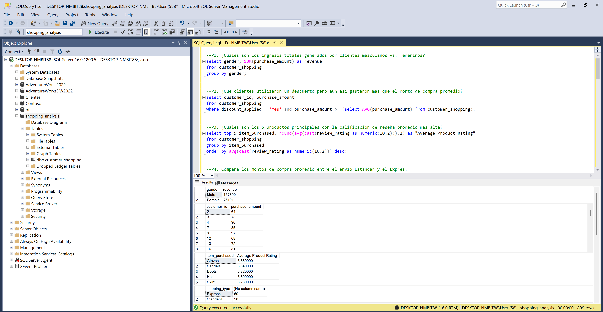

# 🔗 Proyectos End-to-End

Proyectos que recorren el **ciclo completo de analítica** en una sola pieza: el dato entra crudo,
pasa por preparación, se deposita en una base, se consulta y termina en un tablero que abre un
gerente. No son ejercicios de una herramienta — son la cadena completa, con las costuras a la vista.

> **Por qué existe esta sección.** En el resto del portafolio cada carpeta muestra una
> herramienta: [Power BI](../PowerBI_Proyectos), [SQL](../SQL_Proyectos),
> [Python](../Python_Data_Science). Lo que no se ve ahí es **cómo se conectan**: cómo un
> DataFrame limpio se convierte en una tabla de SQL Server, por qué una decisión de imputación
> en pandas aparece tres capas después en una tarjeta del tablero, y qué se rompe en el camino.
> Eso es lo que documentan estos proyectos.

---

## Proyectos

### 🛒 [Customer Shopping Behavior](Customer_Shopping_Behavior)

`Python` · `Pandas` · `SQLAlchemy` · `pyodbc` · `SQL Server 2022` · `T-SQL` · `Power BI` · `DAX`

Análisis del comportamiento de compra de **3,900 clientes** de una empresa retail:
limpieza y feature engineering en pandas, carga a una base **SQL Server creada por código
desde el propio notebook**, **10 preguntas de negocio** resueltas en T-SQL (subconsultas,
CTEs, agregación condicional y funciones de ventana) y un tablero interactivo en Power BI
con 3 medidas DAX y 4 segmentadores.

| Hallazgo | Cifra |
| :--- | :--- |
| Los hombres "generan 2.1× más ingreso"… | …porque son **68% de la base**. Por compra, las mujeres gastan **$60.25 vs $59.54** |
| El programa de suscripción sobre el ticket | **$59 vs $59** — efecto nulo, con 27% de penetración |
| Penetración de suscripción entre compradores recurrentes | **27.6%** vs **27.0%** en la base general — la lealtad **no** predice suscribirse |
| Variación del ticket promedio en **todas** las dimensiones | entre **0% y 11.4%** |

**Por qué importa:** el ticket promedio resultó **plano en género, edad, categoría y
suscripción**. Eso significa que todas las brechas de ingreso que muestran los gráficos son
brechas de **volumen**, no de gasto — y que la recomendación intuitiva ("concentrar el
marketing en hombres, que es donde está el dinero") es exactamente la decisión equivocada.
El problema es de **adquisición**, no de targeting.

📁 **[Ver el pipeline completo, las 10 consultas comentadas y el tablero →](Customer_Shopping_Behavior)**

---

[⬅️ Volver al portafolio principal](../README.md)

