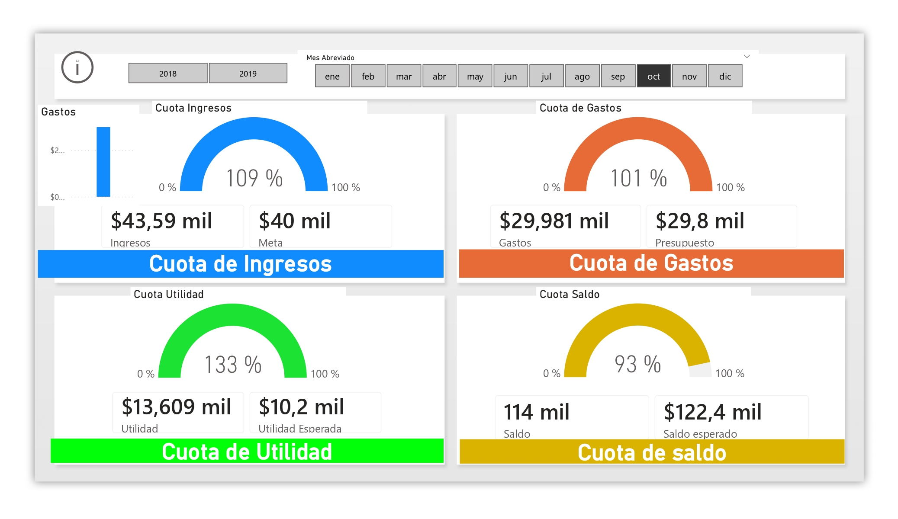
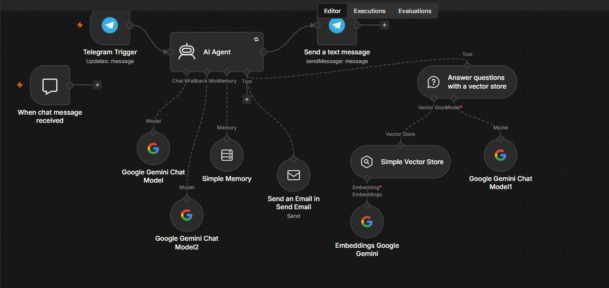
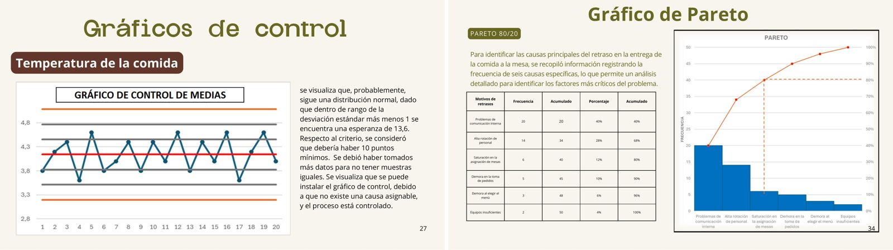

# Eric Salinas Cajaleón
### Data & BI Analyst · Ingeniero Industrial y de Sistemas en formación

**Convierto datos dispersos en tableros y decisiones:**
SQL para modelar · Python para analizar · Power BI para que el negocio lo entienda · n8n y Make para que se ejecute solo

`Python` · `SQL` · `Power BI` · `DAX` · `Excel/VBA` · `n8n` · `Make` · `Google Gemini` · `RAG`

📍 Lima, Perú · 10.º ciclo en la **Universidad de Piura** · Becario **Beca 18** · Egreso: diciembre 2026

> 🎯 **Busco prácticas preprofesionales** en Data & BI, Automatización o Analítica de Operaciones.
> Disponibilidad de 30 h/semana (convenio UDEP).

---

## ⚡ Los tres proyectos que mejor me describen

Si solo tienes dos minutos, mira estos tres. Cada uno enlaza a su carpeta con el archivo fuente, los datos y la documentación completa.

---

### 1️⃣ Control presupuestario y alerta de liquidez · Power BI

Tablero gerencial sobre un dataset financiero 2018–2019, con una **arquitectura de medidas DAX en cuatro capas** (agregación → lógica de negocio → inteligencia de tiempo → KPIs) en lugar de columnas calculadas.

| Hallazgo | Cifra |
| :--- | :--- |
| Cumplimiento de utilidad en el periodo filtrado | **133 %** — $13,609 mil sobre una meta de $10,2 mil |
| Alerta de liquidez detectada en junio '19 | **saldo de $82 mil sobre $122.4 mil esperados (67 %)** |

**Por qué importa:** esa caída de saldo aparece *en el mes* gracias al total acumulado y a la alerta condicional. En un seguimiento manual solo se habría visto al cierre del ejercicio, cuando ya no hay margen para reaccionar.

📁 **[Ver el modelo, las medidas DAX y las 9 vistas del tablero →](PowerBI_Proyectos/Finanzas_Empresariales_2018_2019)**

---

### 2️⃣ Agente conversacional RAG sobre documentos académicos · n8n + Gemini

Agente que responde consultas sobre sílabos universitarios usando una **base vectorial como herramienta**, con memoria aislada por usuario, modelo de respaldo ante fallos y entrega por Telegram. El pipeline de ingesta (PDFs → chunking → embeddings → vector store) vive en un flujo aparte para poder reindexar sin tocar la lógica del agente.

**Por qué importa:** el prompt de sistema le exige **declarar cuándo la información no está en los documentos** en vez de inventarla. Es la defensa más barata contra la alucinación en un sistema RAG, y está escrita explícitamente.

📁 **[Ver los 9 flujos de Make y n8n documentados →](Automatizaciones_IA)**

---

### 3️⃣ Control estadístico de calidad en un restaurante real · SPC

Diagnóstico de calidad de servicio en **"La Tapadita"**, con datos levantados en campo durante 20 días en horas punta. Gráficos de control de medias y desviación sobre cinco dimensiones, análisis de capacidad **Cp/Cpk** y Pareto 80/20 sobre las causas de retraso.

**Por qué importa:** el Pareto mostró que **el 68 % de los retrasos venía de solo dos causas** — problemas de comunicación interna y alta rotación de personal. Eso convierte una queja difusa ("el servicio es lento") en dos acciones concretas.

📁 **[Ver el análisis completo →](Ingenieria_Proyectos/Service_Quality_Analytics_LaTapadita)**

---

## 🗂️ Mapa completo del portafolio

| Área | Qué encontrarás | Stack | Evidencia |
| :--- | :--- | :--- | :--- |
| **[📊 PowerBI_Proyectos](./PowerBI_Proyectos)** | Control financiero y presupuestario · HR Analytics con segmentación demográfica y por banda salarial | `Power BI` `DAX` `Power Query` | 🖼️ 13 capturas · 📦 archivos `.pbix` · 📄 datasets |
| **[🤖 Automatizaciones_IA](./Automatizaciones_IA)** | 9 flujos: agente RAG, pipeline de embeddings, alertas de KPI con y sin IA, generación documental, integraciones | `n8n` `Make` `Gemini` `RAG` | 🖼️ 11 capturas · ⏱️ registros de ejecución reales |
| **[⚡ PowerApps_Proyectos](./PowerApps_Proyectos)** | CRM de ventas en Power Apps sobre SharePoint: 8 pantallas, modelo relacional por IDs y 4 flujos de Power Automate | `Power Apps` `Power Fx` `Power Automate` `SharePoint` | 🖼️ 21 capturas · 🔤 fórmulas Power Fx documentadas |
| **[🐍 Python_Data_Science](./Python_Data_Science)** | 7 laboratorios de ML: K-Means, KNN, árboles, PCA, K-Folds, redes neuronales, serialización | `Python` `Scikit-learn` `TensorFlow` | 📓 notebooks con gráficos renderizados |
| **[🗄️ SQL_Proyectos](./SQL_Proyectos)** | Diseño de esquemas en 3FN, KPIs de almacén, análisis en PostgreSQL | `MySQL` `PostgreSQL` `SQL Server` | 💾 scripts `.sql` comentados |
| **[📉 Exel_Proyectos](./Exel_Proyectos)** | 13 soluciones: Solver/Simplex, macros VBA, dashboards, previsión ETS, RPA con Outlook | `Excel` `VBA` `Solver` `Power Query` | 🖼️ 4 capturas · 📦 archivos `.xlsm` funcionales |
| **[⚙️ Ingenieria_Proyectos](./Ingenieria_Proyectos)** | 14 casos: teoría de colas, SPC, redes logísticas, simulación Montecarlo, IoT, programación lineal | `M/M/s` `SPC` `Solver` `UML` `ESP32` | 📄 informes completos · 📊 hojas de cálculo con los modelos |

---

## 📈 Casos con cifras, de un vistazo

Todos son proyectos sobre **operaciones de empresas reales**, con levantamiento de información en campo.

| Caso | Qué se midió | Resultado |
| :--- | :--- | :--- |
| **[Tottus — sistemas de colas](Ingenieria_Proyectos/OptiQueue_Tottus)** | Llegadas y tiempos de servicio en buffet, horas punta | Distribuciones validadas con **Chi-cuadrado**; modelo **M/M/s** muestra que pasar de 4 a 5 servidores reduce la cola sobre una operación de **~S/ 300,000 mensuales** |
| **[Redes de distribución](Ingenieria_Proyectos/Optimizacion_Redes_Logistica)** | Costos de transporte multi-nodo con transbordo | Ruta de **costo mínimo de $270,000** y utilidad neta optimizada de **$93,500** |
| **[Previsión de demanda](Ingenieria_Proyectos/Sales_Forecasting_Model)** | Descomposición de serie de tiempo (T, S, C, I) | Estacionalidad cuantificada: **diciembre +6.82 %**, **febrero −4.71 %**, con límites de confianza para gestión de inventario |
| **[Automatización documental](Automatizaciones_IA)** | Formulario → IA → documento → Drive → correo | **6 operaciones encadenadas en ~36 segundos**, sin intervención manual |
| **[Dashboard de ventas en Excel](Exel_Proyectos)** | Facturación mensual por categoría, región y vendedor | **S/ 249,721** analizados con segmentadores, línea de tiempo y macros de envío por Outlook |
| **[Clavecín UDEP — IoT](Ingenieria_Proyectos/Microclimate_Control_IoT_UDEP)** | Telemetría de temperatura y humedad con ESP32 + DHT22 | Mapeo de gradientes térmicos para prevenir el deterioro de un instrumento patrimonial |

---

## 🛠️ Stack técnico

**Análisis y programación**
`Python` `Pandas` `NumPy` `Scikit-learn` `TensorFlow/Keras` `Matplotlib` — limpieza, EDA, clustering, clasificación, PCA, validación cruzada

**Bases de datos**
`MySQL` `PostgreSQL` `SQL Server` — diseño de esquemas, normalización 3FN, joins, subconsultas, agregaciones y KPIs

**BI y visualización**
`Power BI` `DAX` `Power Query` `Excel avanzado` `VBA` `Looker Studio` — modelo en estrella, medidas modulares, alertas condicionales

**Automatización e IA aplicada**
`n8n` `Make` `Google Gemini` `RAG` `Vector stores` `Power Automate` `Power Apps` `SharePoint` — agentes con herramientas y memoria, pipelines de embeddings, integración de APIs

**Ingeniería y métodos cuantitativos**
`Teoría de colas (M/M/s)` `SPC / Cp-Cpk` `Simplex` `Simulación Montecarlo` `Lean` `Six Sigma` `UML` `BPM`

---

## 🎓 Formación y certificaciones

**Universidad de Piura (UDEP)** — Ingeniería Industrial y de Sistemas, 10.º ciclo
Becario **Beca 18** (PRONABEC), beca integral por alto rendimiento académico · 2022 – dic. 2026

**CTIC – UNI · Programa de Innovación Tecnológica (PIT)**
✅ Aplicaciones de Inteligencia Artificial · ✅ Automatización de Negocios con Gemini · ✅ Machine Learning con Python · ✅ Finanzas para la Toma de Decisiones Tecnológicas
🔄 *En programa:* Inferencia Estadística con Python · Series de Tiempo · Big Data · Cloud Computing (AWS/Azure/GCP)

| Certificación | Entidad | Fecha |
| :--- | :--- | :--- |
| **Associate Data Analyst in SQL** | DataCamp | 2026 |
| Fundamentos de Estadística · Python para Finanzas | DataCamp | 2026 |
| **Microsoft Power Apps y Power Automate** | Datux Perú · Microsoft Partner Network | Agosto 2026 |
| **Power BI + Business Intelligence** (22 h) | Cámara de Comercio Exterior | Febrero 2026 |
| **Especialista en Excel Avanzado** (127 h) | Cámara de Comercio Exterior | Febrero 2026 |

---

## 🧭 Cómo recorrer este repositorio

- **¿Vienes de una vacante de BI?** → [PowerBI_Proyectos](./PowerBI_Proyectos) y luego [SQL_Proyectos](./SQL_Proyectos).
- **¿De una vacante de automatización o IA?** → [Automatizaciones_IA](./Automatizaciones_IA).
- **¿De una vacante de Power Platform / aplicaciones internas?** → [PowerApps_Proyectos](./PowerApps_Proyectos).
- **¿De operaciones, supply chain o mejora de procesos?** → [Ingenieria_Proyectos](./Ingenieria_Proyectos).
- **¿Quieres ver código?** → los notebooks en [Python_Data_Science](./Python_Data_Science) y los scripts en [SQL_Proyectos](./SQL_Proyectos).

Cada carpeta tiene su propio README con el contexto del proyecto, la metodología y las capturas.

---

### 📫 Conversemos

*Pueblo Libre, Lima, Perú · Disponible para modalidad presencial, híbrida o remota*

